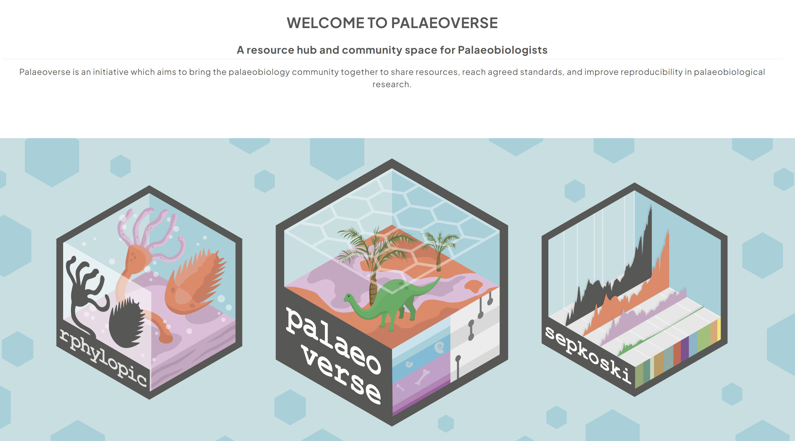

## Organizer Introductions

:::: {.columns .h4}
::: {.column width="33%"}

Will Gearty

Syracuse University

:::

::: {.column width="33%"}

Erin Dillon

Smithsonian Tropical Research Institute

:::

::: {.column width="33%"}

Mark Nikolic

Stanford University

:::

::::

## Palaeoverse

## Guest Introductions

:::: {.columns .h4}
::: {.column width="33%"}

Broc Kokesh

University of California, Berkeley

:::

::: {.column width="33%"}

Pedro M. Monarrez

Virginia Tech

:::

::::

## Why open science?

::: {.incremental}

- Open science aims to make research and its outcomes—at all stages—more accessible
    - Increases transparency, reproducibility, and reusability
    - Facilitates collaboration
    - Broadens access to scientific knowledge
    - Enhance the impact and reach of our science
:::

## Objectives

. . .

- **Goal:** overview of how to process paleontological data in an open and reproducible way

. . .

- **Learning objectives:**
    -  Gain exposure to tools and best practices for developing and sharing reproducible workflows
    -  Build confidence working with data in R
    -  Practice coding collaboratively
    -  Connect with other workshop participants
    

## Resources

. . .

- **You'll walk away with:**
    -  Template for creating a workflow and example code that you can adapt to your own work
    -  Workshop materials and resources
    -  An expanded network of colleagues
    
. . .

- **Workshop website:** <https://workshop.palaeoverse.org>

## Schedule

::: {.columns .h3}

::: {.column width="15%"}

:::

::: {.column width="70%"}

| Time         | Event                                                     |
|--------------|-----------------------------------------------------------|
| **08:00 AM** | [**Welcome and introduction**](../01_introduction/index.qmd)   |
| **08:30 AM** | [**Setting up a reproducible workflow (GitHub, GitHub Desktop, RStudio)**](../02_workflow/index.qmd)      |
| **10:00 AM** | ***Coffee break*** ☕                                     |
| **10:15 AM** | [**Data acquisition**](../03_acquisition/index.qmd)          |
| **10:45 AM** | [**Data Processing I: Data exploration and cleaning**](../04_exploration/index.qmd)      |
| **12:00 PM** | ***Lunch break*** 🥪                                     |
| **1:30 PM**  | [**Data Processing II: Data visualization and synthesis**](../05_visualization/index.qmd)  |
| **3:15 PM**  | ***Coffee break*** ☕                                     |
| **3:30 PM**  | [**Ethical open science**](../06_ethical/index.qmd)  |
| **4:45 PM**  | [**Closing remarks**](../07_wrap-up/index.qmd)                                 |

: {tbl-colwidths="[20,80]"}

:::

:::

## Logistics

- Room 211
- Restrooms
- Exits
- Internet

## Raise your hand if...

::: {.incremental}

- you are just getting started in R
- you feel comfortable coding in R
- you work with R so much that you dream in ggplot
- you have used GitHub before
- you have downloaded data from a database
- you have archived your data and/or code

:::

## Meet your colleagues!

- Name
- Institution
- Career stage
- Research interests
- Example of open science in action?
