## Goals

- Understand the importance of reproducible workflows and version control
- Explore version control with GitHub and GitHub Desktop
- Learn how to set up a project in RStudio
- Learn how to collaborate on a project via Git and GitHub

::: notes
:::

## Why reproducible workflows are important

::: {.incremental}

- It's good science
- Don't reinvent the wheel
- Improves uptake of methods (more citations!)
- Ease of collaborations
- Funders love Open Science

:::

::: notes
:::

## What makes a workflow reproducible?

::: {.incremental}

- Can be understood by other researchers (and your future self)
- Yields identical results every time (unless there is randomness)
- Works on any machine, even in the future (this part can still be a little tricky)

:::

::: notes
:::

## How to make your workflow reproducible

- Code your workflow in a programming language (today we'll use R)
- Use version control to keep track of changes (today we'll use Git/GitHub)
- Standardize file directory structure (we'll use RProjects to help with this)
- Archive your materials (e.g., Zenodo, Dryad) (more this afternoon)

## Version history vs version control {.smaller}

:::: {.columns}

::: {.column width="45%" .fragment fragment-index=1}
### Version history

```{mermaid}
%%| echo: false
gitGraph
    commit id: "Initial commit"
    commit id: "Add data"
    commit id: "Add analysis script"
    commit id: "Update analysis script"
```

:::: {.absolute top=350 width="45%"}
- Tracked changes
- Allows for rollbacks
- Easy collaboration, but with potential conflicts
- Software determines save points
- No experimentation
- Can lead to feature breakage
::::

:::

::: {.column width="10%"}
:::

::: {.column width="45%" .fragment fragment-index=2}
### Version control

```{mermaid}
%%| echo: false
gitGraph
    commit id: "Initial commit"
    commit id: "Add data"
    commit id: "Add analysis script"
    branch will
    commit id: "Add viz script"
    checkout main
    commit id: "Update analysis script"
    merge will
    
```

::::{.absolute top=350}
- Tracked changes
- Allows for rollbacks
- Easier collaboration without direct conflicts
- Users determine save points
- Allows for experimentation
- Prevents feature breakage
::::

:::

::::

::: notes
:::

## Version control and collaboration

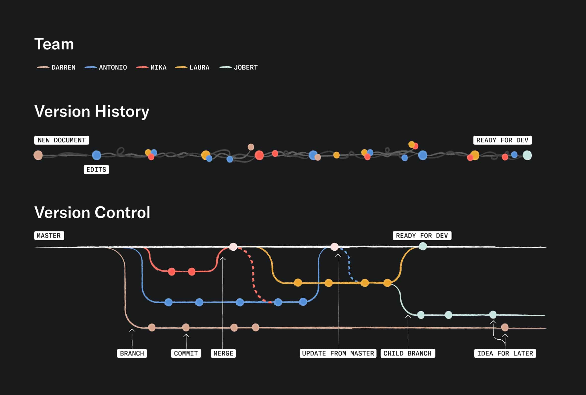{fig-align="center" width="60%"}

::: notes
Version history is not the same as version control. Version history is a record of changes made to a file, while version control is a system that manages changes to files and allows for collaboration among multiple users. Version control systems like Git provide features such as branching, merging, and conflict resolution, which are essential for collaborative work.
:::

## Version control with git

{fig-align="center" width="100%"}

## Version control with git and GitHub

:::: {.columns}

::: {.column width="50%"}
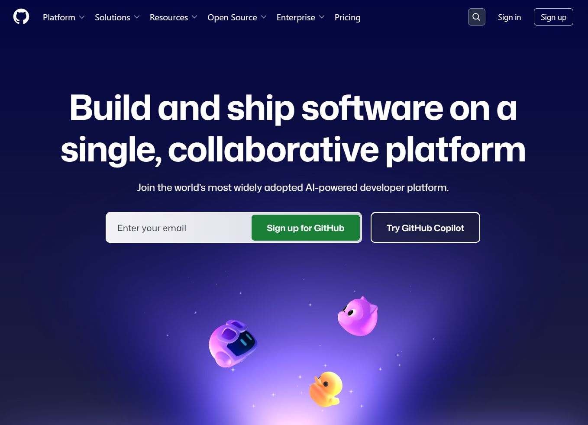{fig-align="center"}
GitHub (platform)
:::

::: {.column width="50%"}
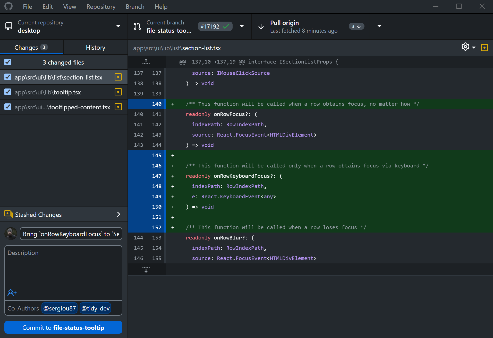{fig-align="center"}
GitHub Desktop (software)
:::

::::


## Repositories

[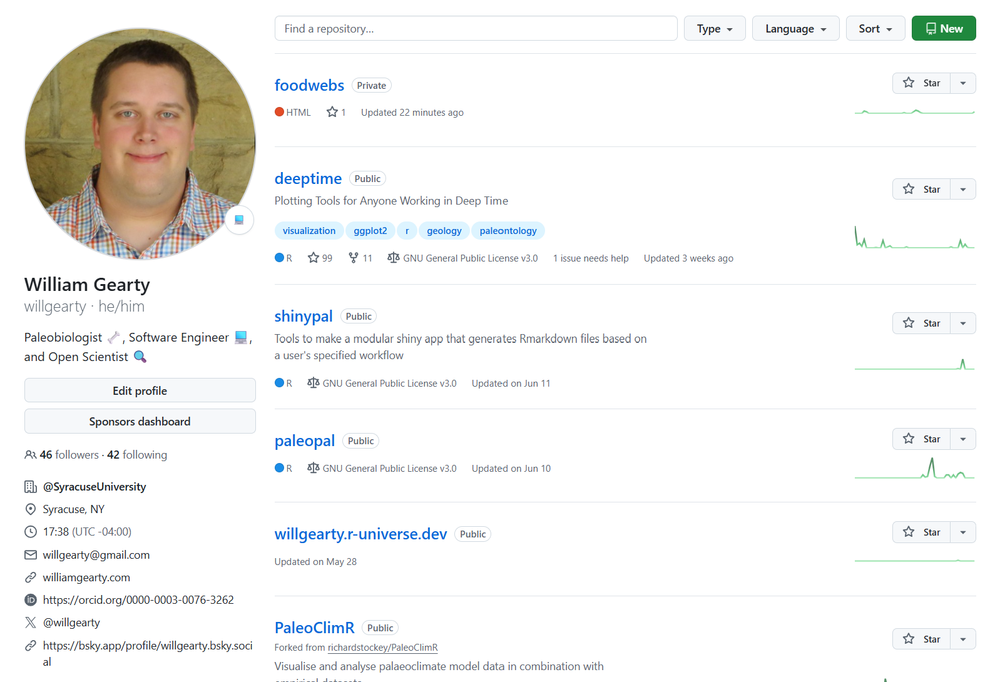{fig-align="center" width="60%"}](https://github.com/willgearty?tab=repositories)

<center>
[https://github.com/willgearty?tab=repositories](https://github.com/willgearty?tab=repositories)
</center>

::: notes
Repositories, aka "repos", represent independent file environments on GitHub.
:::

## Repositories (cont.)

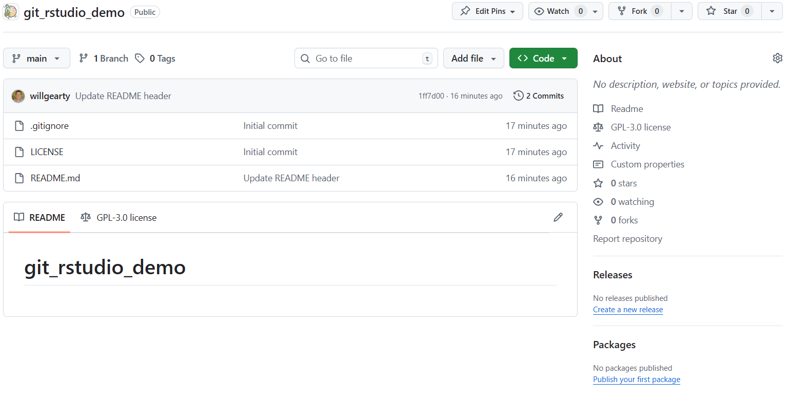{fig-align="center" width="60%"}

<center>
[https://github.com/palaeoverse/git_rstudio_demo](https://github.com/palaeoverse/git_rstudio_demo)
</center>

::: notes
Point out:
- file structure: has files and folders
- README: emphasize the importance of a README file for providing context and instructions for the repository
- license: mention that the license file is important for specifying how others can use the code and data in the repository
- contributors: can see who has contributed to the repository and their contributions
:::

## Forking a repository

You can easily make your own copy of a repository by "forking" it

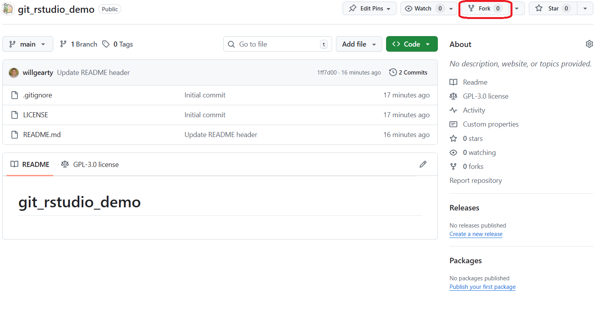{fig-align="center" width="80%"}

::: notes
Walk through this process with everyone. Make sure everyone has forked the repository before moving on.
:::

## Cloning your new repository

Now we're going to "clone" this repo to our local machine using GitHub Desktop.

:::: {.columns}

::: {.column width="50%"}
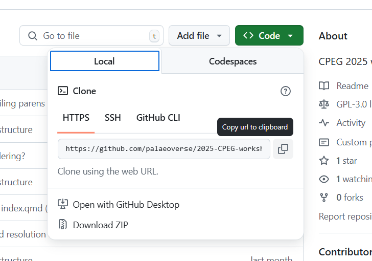{fig-align="center"}
:::

::: {.column width="50%"}
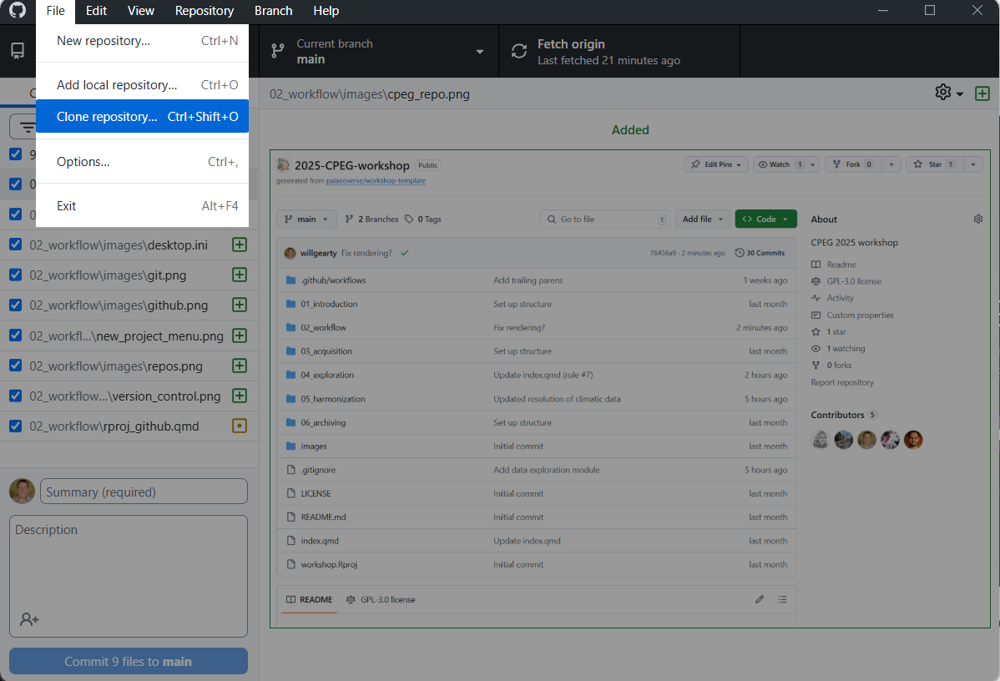{fig-align="center"}
:::

::::

::: notes
Walk through this process with everyone. You will need to select the folder where you want to clone the repository. Make sure everyone has cloned the repository before moving on.
:::

## RStudio {.smaller}

- RStudio is an IDE (integrated development environment) for R
  - Makes it easier to write and run R code
  - Provides a user-friendly interface for managing files, packages, and projects
  - Includes features like syntax highlighting, code completion, and debugging tools

{fig-align="center" width="100%"}

## Aside: Workspace Hygiene {.smaller}

**Start from a clean slate!**

Your workspace is your laboratory - keep it free of contamination!

. . .

***Tools > Global Options > General***

In the "Basic" tab

- Unceck "Restore .RData into workspace at startup"
- Set "Save workspace to .RData on exit" to "Never"

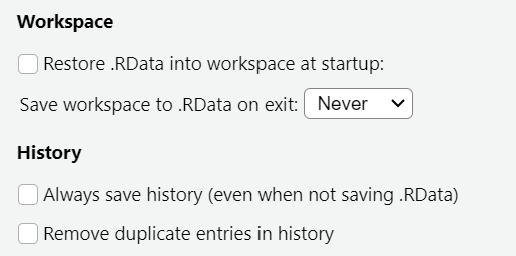{fig-align="center" width="50%"}

## RProjects {.smaller}

- RProjects are a way to organize your work in RStudio
  - Established by the addition of an `.Rproj` file
  - Opening the project sets the working directory automatically
  - Whole project folder can be passed between machines and people

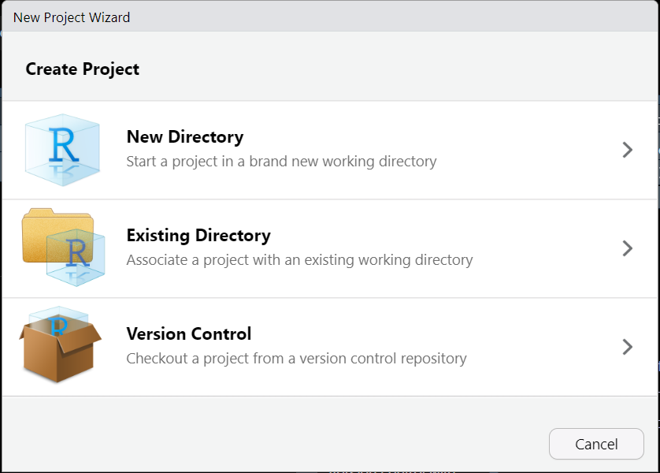{fig-align="center" width="100%"}

## Aside: Absolute and Relative Paths

. . .

Your code should run on any machine!

. . .

```{r}
#| eval: false
#| echo: true
# BAD PRACTICE: path and data does not exist on other machines
read.csv("C:/path/to/important/raw/data.csv")
```

. . .

```{r}
#| eval: false
#| echo: true
# BAD PRACTICE: works only on one specific machine
setwd("C:/Users/willg/OneDrive - Syracuse University/Palaeoverse/workshop")
```

. . .

```{r}
#| eval: false
#| echo: true
# BAD PRACTICE: requires manual work
# to run this script, go to
# Session -> Set Working Directory -> To Source File Location
# to set your working directory correctly
```

. . .

This is why we use RProjects! You just need to set the path to a file relative to the `.Rproj` file:
```{r}
#| eval: false
#| echo: true
# GOOD PRACTICE: works on any machine
read.csv("data/raw/data.csv")
```

## Making a new R project

Now let's make a new R project based on this forked repository...

:::: {.columns}

::: {.column width="30%"}
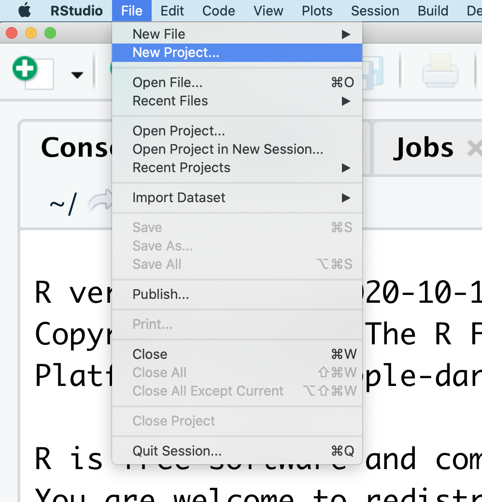{fig-align="center"}
:::

::: {.column width="35%"}
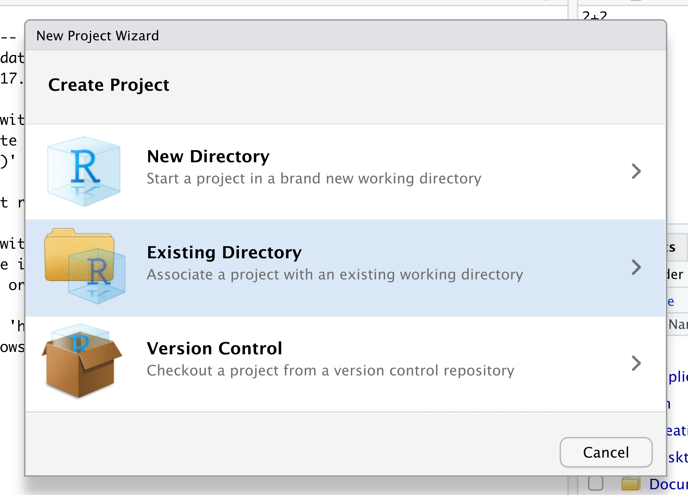{fig-align="center"}
:::

::: {.column width="35%"}
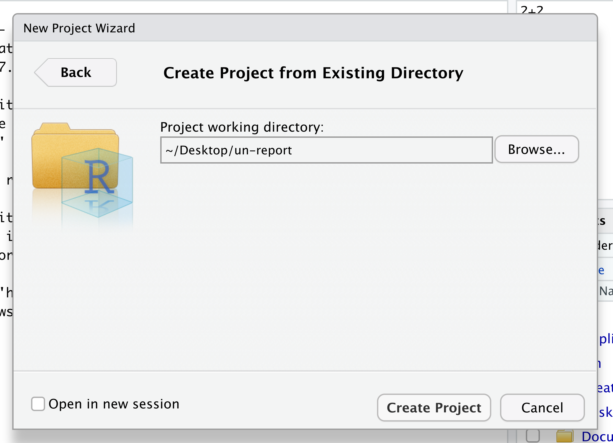{fig-align="center"}
:::

::::

::: notes

:::

## Making and committing changes {.smaller}

Now let's make some changes to the repository:

1. Open the `README.md` file in RStudio and add some text to it. Perhaps your name, today's date, and a short poem. Make sure to save the file.
2. Now open GitHub Desktop again. You'll now see that the `README.md` file has been modified. There should also be a new .Rproj file in the list of changed files.
3. Make sure the checkboxes next to both of these files are checked.
4. In the small "Commit message" box below, write a brief message about the changes you made (it probably already says something like "Update README.md"). The larger box below this can be used if you need to further describe your changes.
5. Click the "Commit" button to commit the changes to your **local repository**.
6. Click the "Push origin" button to upload your changes to GitHub.

::: notes

:::

## Advanced RStudio and RProjects {.smaller}

You're well on your way to becoming an RStudio super user! Here are some more advanced RStudio and RProjects features that you can explore on your own:

- [Multiple projects in parallel](https://support.posit.co/hc/en-us/articles/200526207-Using-RStudio-Projects)
- [Reproducible environments & package versioning using `renv`](https://rstudio.github.io/renv/articles/renv.html)
- [Packaging of R code](https://r-pkgs.org/)
- [Quarto](https://quarto.org/): A scientific and technical publishing system that let's you write entirely in RStudio
  - this entire website was built with Quarto!

## Collaborating with Git and GitHub {.smaller}

Now let's learn how to actually collaborate with Git and GitHub!

1. Find a partner.
2. **Fork** your partner's repository on GitHub (you'll need to change the repo name since you already have a repo with that name).
3. **Clone** this forked repository to your local machine using GitHub Desktop.
4. Make a **new branch** in GitHub Desktop (name it "[name]-edits").
5. Make some changes to the `README.md` file in RStudio (add your name next to your partner's name and add your own poem beneath your partner's poem).
6. **Commit** and **push** your changes to your branch in GitHub Desktop.
7. Go to your partner's repository on GitHub and create a **pull request**.
8. Your partner should **review** the changes and **merge** the pull request.
9. Your partner should then **pull** the changes to their local machine using GitHub Desktop.

## Advanced GitHub {.smaller}

Congratulations, you're now a GitHub pro!

. . .

Well, maybe not...but if you want to be, here are some GitHub resources that you can explore on your own:

- [GitHub Issues](https://docs.github.com/en/issues): Track bugs and feature requests (yes, this applies to research code!)
- [Pull Requests](https://docs.github.com/en/pull-requests): Propose changes to a repository and collaborate with others
- [GitHub Actions](https://docs.github.com/en/actions): Automate workflows
- [GitHub Pages](https://pages.github.com/): Host websites directly from your GitHub repositories
- [GitHub Classroom](https://classroom.github.com/): Tool for managing assignments and grading in educational settings

## Prepare for the Remaining Modules {.smaller}

For the remaining modules, you'll need to fork and clone our workshop resources repository. Once cloned, double click the `workshop.Rproj` file to open the RProject in RStudio.

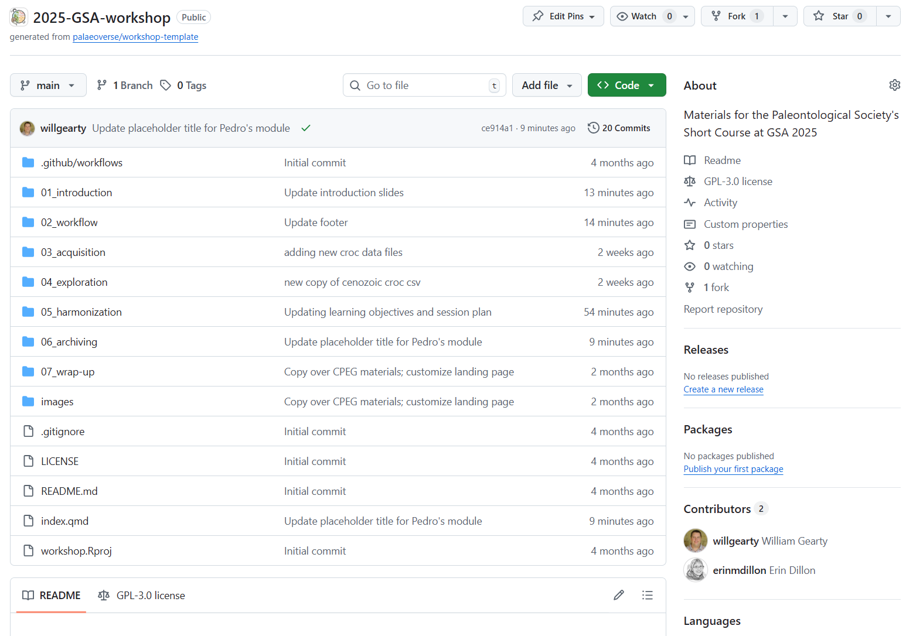{fig-align="center" width="40%"}

<center>
[https://github.com/palaeoverse/2025-GSA-workshop](https://github.com/palaeoverse/2025-GSA-workshop)
</center>
