## Learning objectives

- Why data visualization is important
- Strategies for effectively visualizing data
- How to create basic graph types in R
- Example code to modify

## Schedule
\
1:30 - 2:00 PM: Theory of data visualization\
\
2:00 - 3:15 PM: Data visualization practical

## Theory of data visualization

- What is data visualization?
- Picking a graph type
- Basic design principles
- Visualization in R

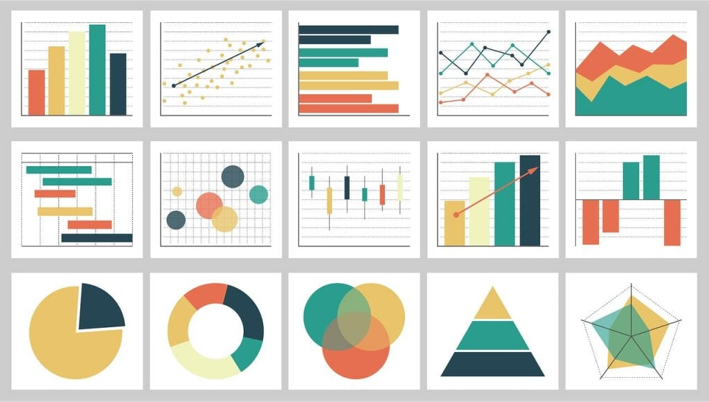{fig-align="left" height="300"}

::: notes
:::

# What is data visualization?

## What is data visualization?

::: columns
::: column
\
The representation of data through the use of __graphs__ and __figures__.\
\
Often the data are __complex__, but the representation should be __approachable__ and __easy-to-understand__.
:::

::: column
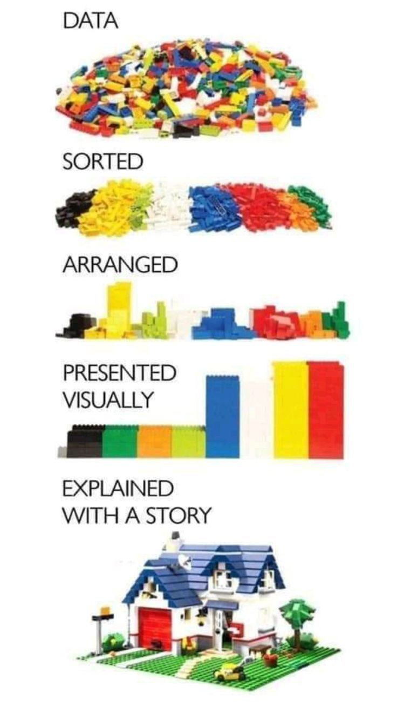{width=60%}
:::
:::

## Let's look at some examples

For example, here are some __data__:

[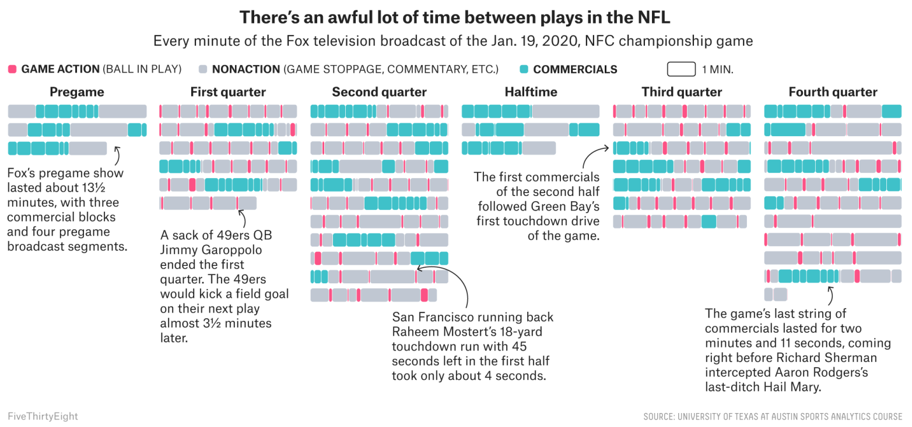{height="500"}](https://fivethirtyeight.com/features/how-much-football-is-even-in-a-football-broadcast/)
(even this is a data visualization)

::: notes
Relative YouTube listening of Rihanna compared to the other Billboard Top 100 in 2017 across the US. Made by the New York Times using geocoded streaming data from YouTube.
:::

## Let's look at some examples

And here is a __data visualization__ of that data:

[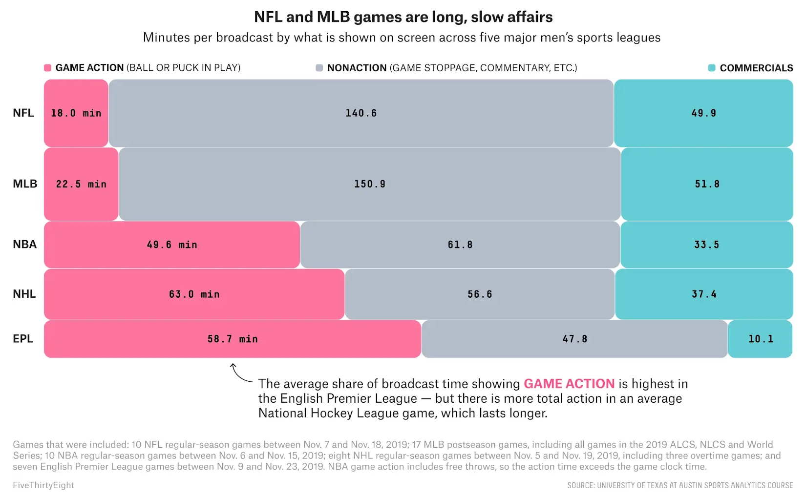{height="550"}](https://fivethirtyeight.com/features/how-much-football-is-even-in-a-football-broadcast/)

::: notes
Relative proportions of a sports game that entails "game action", "game inaction", or "commercials". English Premier League shows the highest proportion of game action. NHL games have the most (total) game action.
:::

## Let's look at some examples

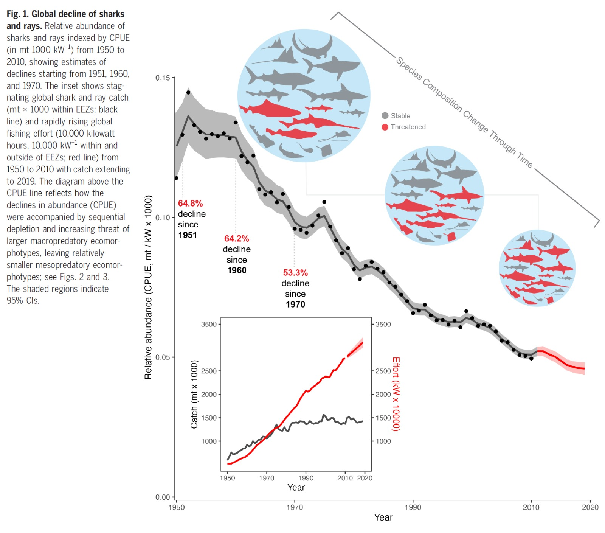{height="600"}

## How would you improve this figure?

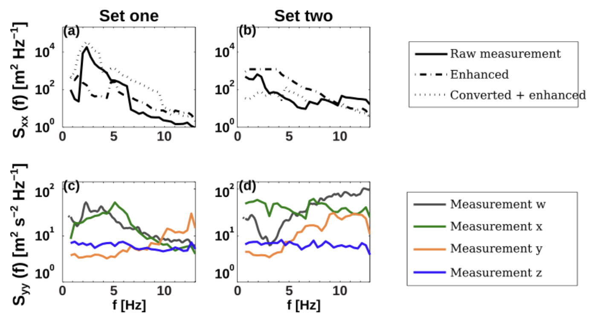{fig-align="center" height="500"}

::: notes
-give groups 5 min to discuss: 1) what would they change; 2) what makes a figure memorable
problems: (1) Space is poorly used and data are cramped. (2) Text is bold for no reason. (3) Multiple fonts are used. (4) Tick marks are barely visible. (5) Some labels don’t fit in their respective boxes. (6) Axis values are unnecessarily repeated. (7) Dashed and dash-dotted lines are ugly. (8) Mathematical symbols are not italicised. https://brushingupscience.com/2021/05/18/ugly-scientific-figures-are-scientists-lazy-indifferent-or-oblivious/
:::

## What makes a bad scientific figure?

::: columns
::: column
::: {style="font-size: 0.55em;"}
- too much data shown (split into multiple panels)
- improper choice of graph type (avoid 3D plots)
- no clear message
- information not laid out in a clear way
- axes with no (or inappropriate) labels or units
- misleading portrayal of scale and uncertainty (e.g., truncated axes)
- no legend
- inconsistent colors and formatting, cluttered appearance
- not visually accessible, too many colors, lacking contrast
- colors/symbols not used to highlight relationships or patterns
- no readable text hierarchy
- poor resolution
:::
:::

::: column
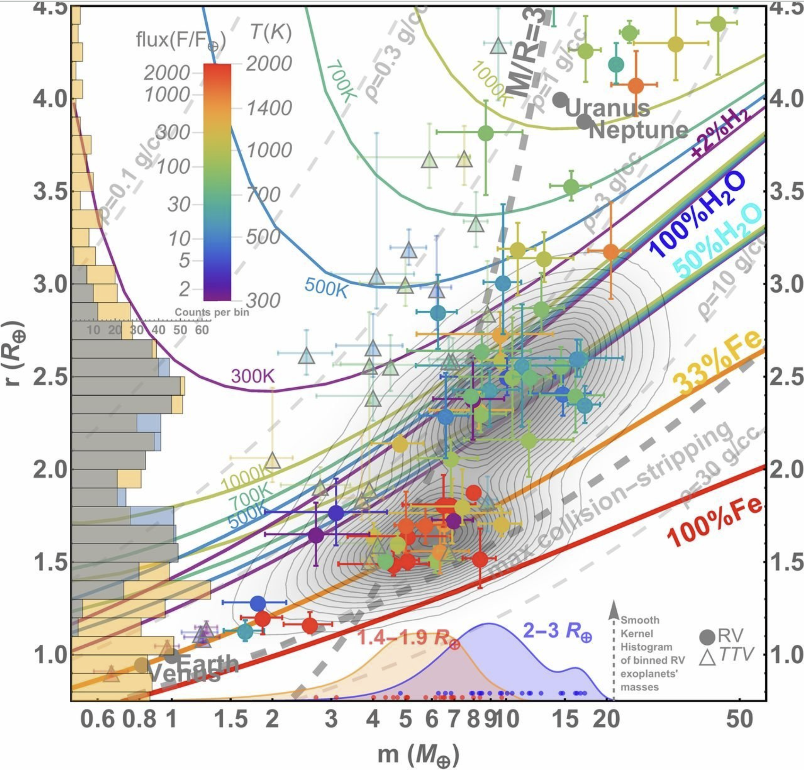{width=100%}
:::
:::

# Picking a graph type

## Graph type depends on data type

[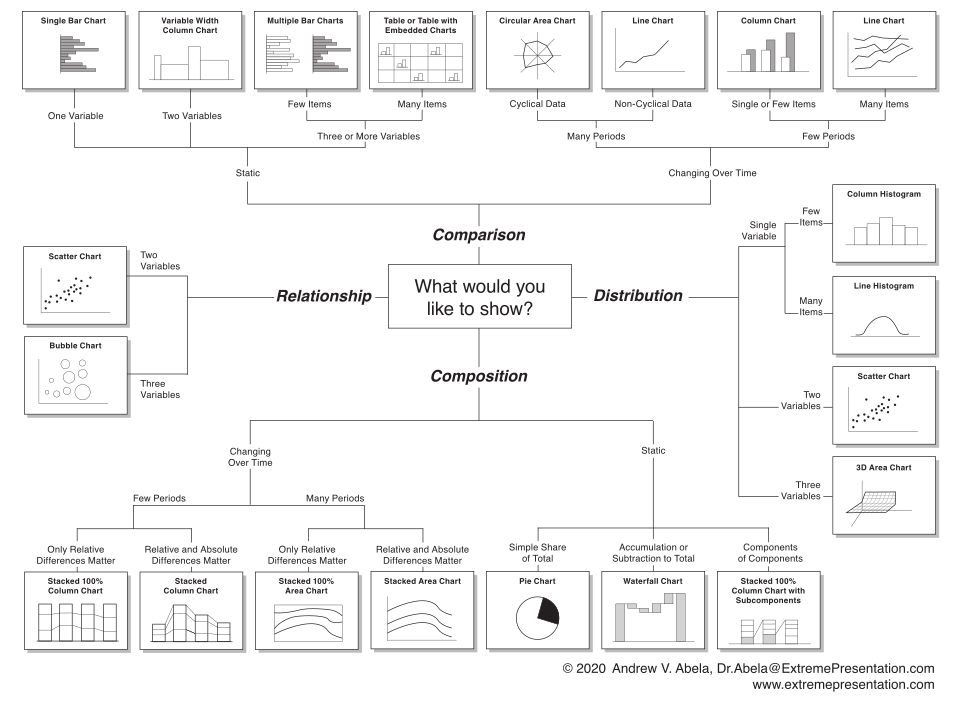{height="650"}](https://extremepresentation.typepad.com/blog/2006/09/choosing_a_good.html)

::: notes
We don't have time to go over this entire chart, but it should be a good reference for the future. Note that the first question is what aspect of the data you would like to show: relationships, comparisons, distributions, or compositions. From there, we need to decide how many variables we want to include and/or whether we are showing changes over time.
:::

## R Graph Gallery
[https://r-graph-gallery.com/](https://r-graph-gallery.com/)

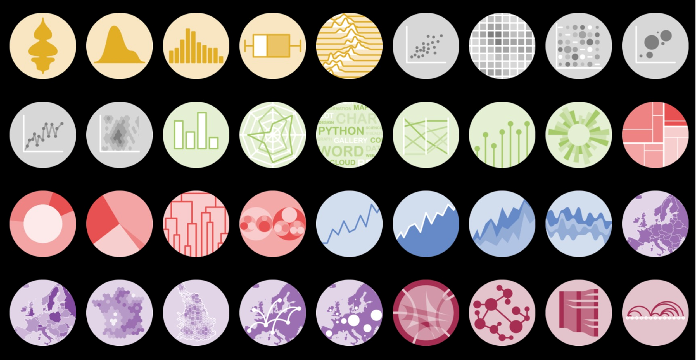{height="400"}

## R Graph Gallery
[https://r-graph-gallery.com/](https://r-graph-gallery.com/)

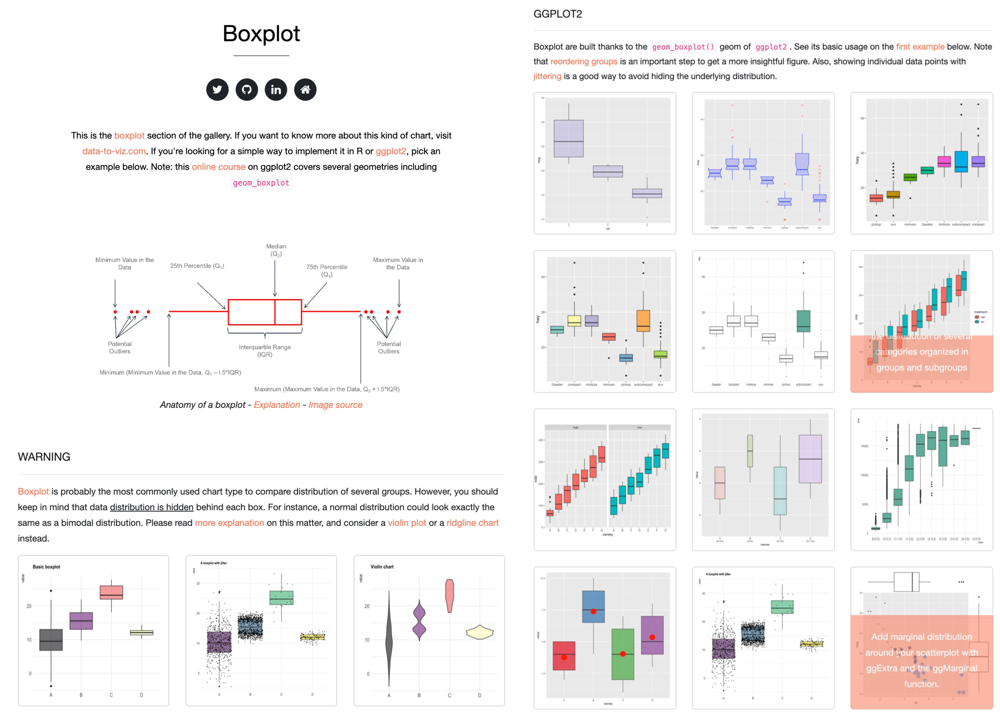{height="550"}

## Plotly
[https://plotly.com/r/](https://plotly.com/r/)

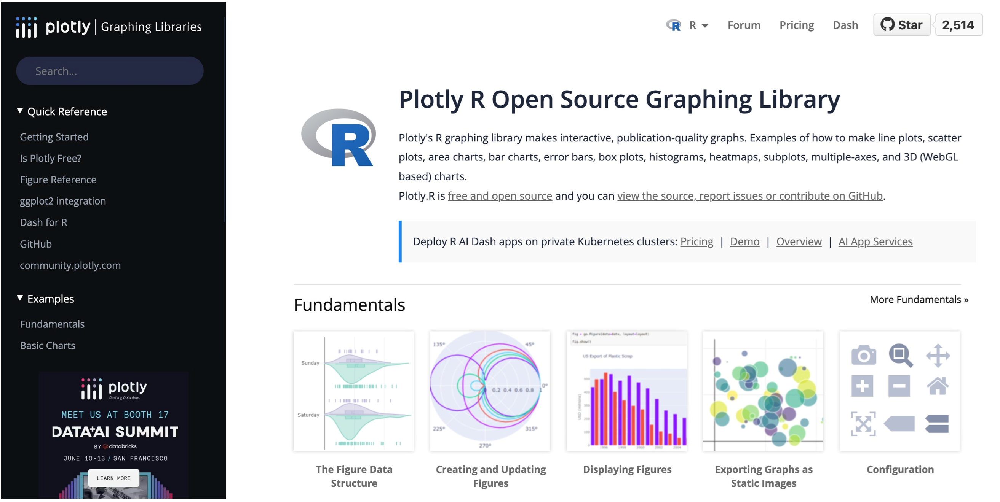

# Basic design principles

## Basic design principles

- Visual encoding of data points
- Color
- Type (Font)
- Visual hierarchy
- Composition and layout (R helps with this)

## Visual encoding
::: {style="font-size: 0.8em;"}
Marks and channels to visually represent groups in the data:
::: 
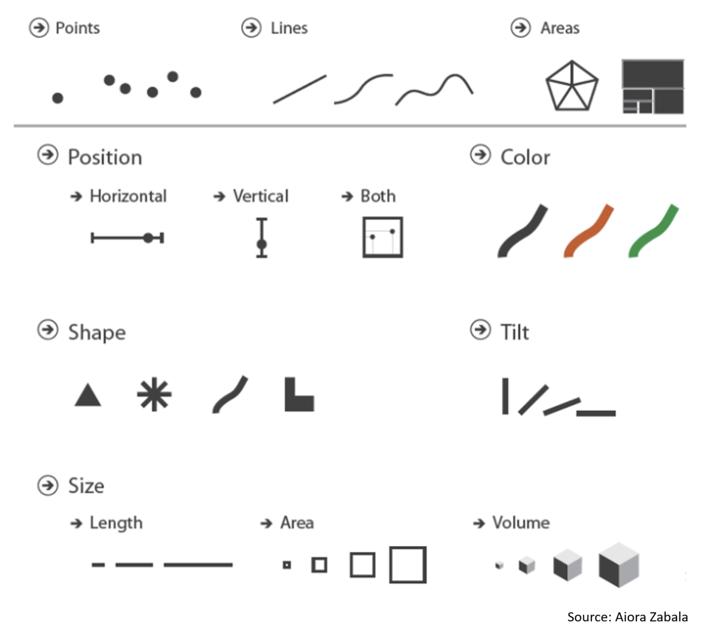{height="500"}

## Color

### Lots of colors exist!

[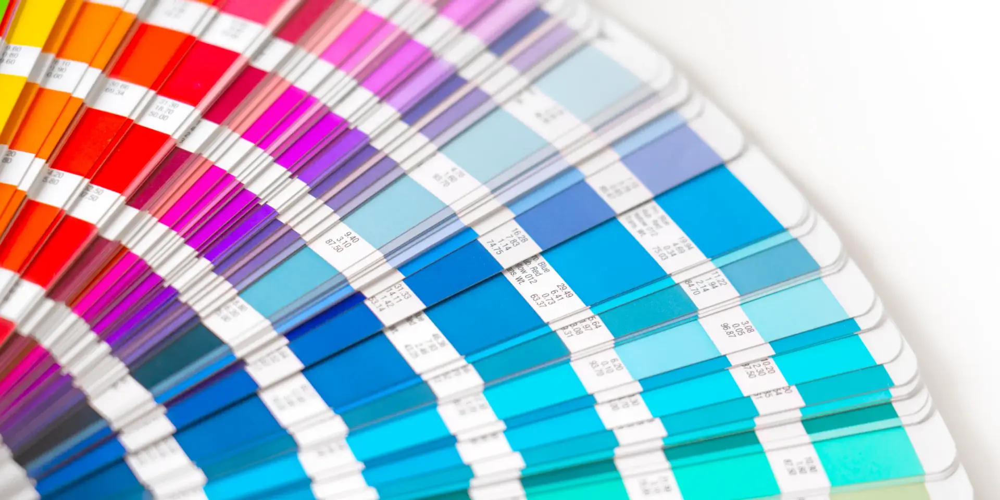{height="500"}](https://create.microsoft.com/en-us/learn/articles/what-is-color-theory)

## Color

### Picking colors

- Value (lightness/darkness)

[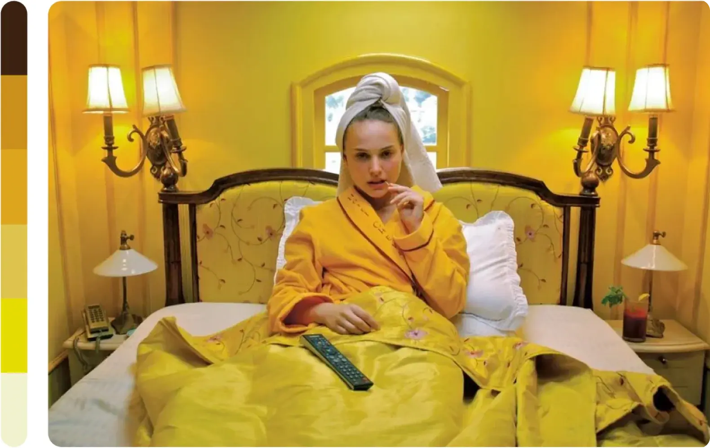{height="400"}](https://create.microsoft.com/en-us/learn/articles/what-is-color-theory)

::: notes
:::

## Color

###  Picking colors

- Temperature (cool vs warm)

[{height="400"}](https://create.microsoft.com/en-us/learn/articles/what-is-color-theory)

::: notes
:::

## Color

### Picking colors

- Saturation (intensity of color)

[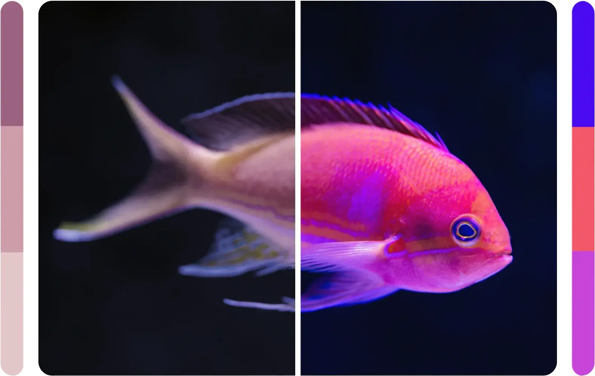{height="400"}](https://create.microsoft.com/en-us/learn/articles/what-is-color-theory)

::: notes
:::

## Color

### Picking colors

- Palettes (collections of colors that work well together)

[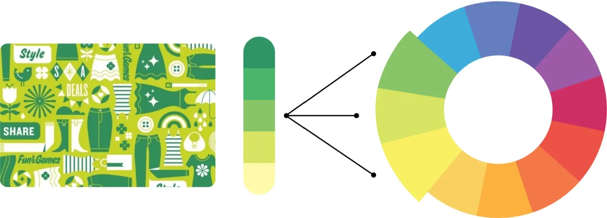{width="900"}](https://create.microsoft.com/en-us/learn/articles/what-is-color-theory)

::: notes
Analogous colors are three colors next to each other on the color wheel, composed of one dominant color (usually a primary or secondary color), then a supporting color (a secondary or tertiary color), and a third color that is either a mix of the two first colors, or an accent color that pops.
:::

## Color

### Picking colors

- Palettes (collections of colors that work well together)

[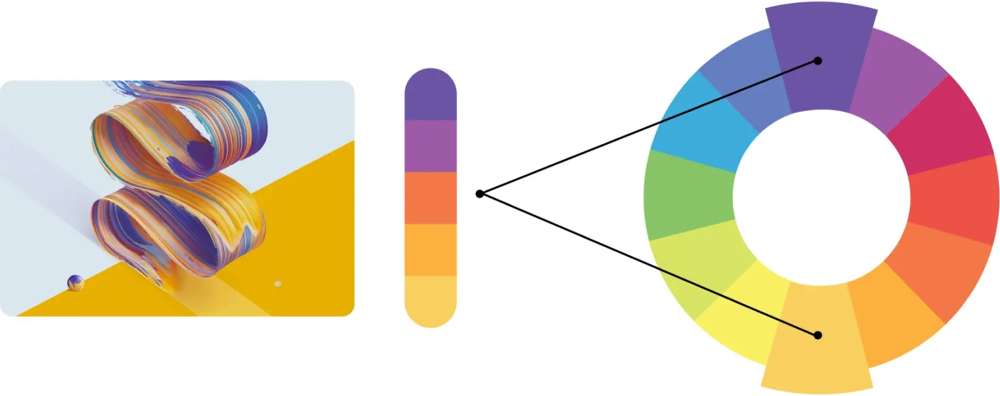{width="900"}](https://create.microsoft.com/en-us/learn/articles/what-is-color-theory)

::: notes
A complementary color scheme is created by using two colors opposite each other on the color wheel. This type of palette attracts the most attention because of its bold contrast, but that also makes it the most difficult to find a harmonious balance. One way to achieve good balance when using complementary colors is to identify two opposite colors (as shown in the image below) and then create the rest of your palette by creating slightly darker or lighter versions of those same colors.
:::

## Color

### Declaring colors in R

- Names (see [cheat sheet](https://www.nceas.ucsb.edu/sites/default/files/2020-04/colorPaletteCheatsheet.pdf))

- HEX codes

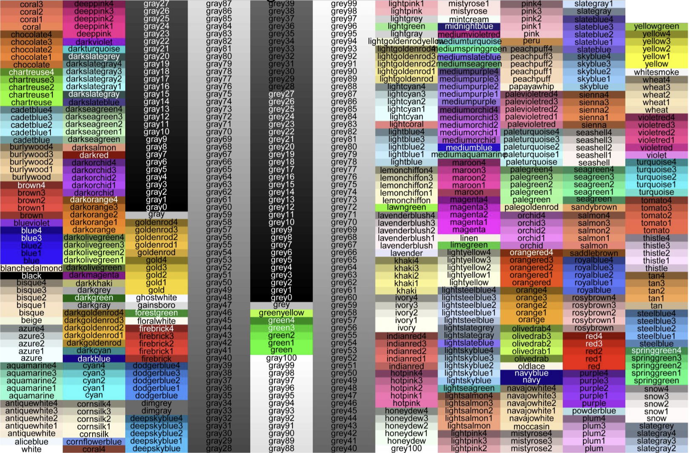{height="350"}

::: notes

:::

## Color

### Getting HEX codes

- In software (e.g., PowerPoint, Illustrator, Inkscape)
- Online (e.g., [Google](https://g.co/kgs/YAVBHVg), [HTML color codes](https://htmlcolorcodes.com/color-chart/), [coolers](https://coolors.co/), [Colorhunt](https://colorhunt.co/))
- <code>{eyedroppeR}</code>

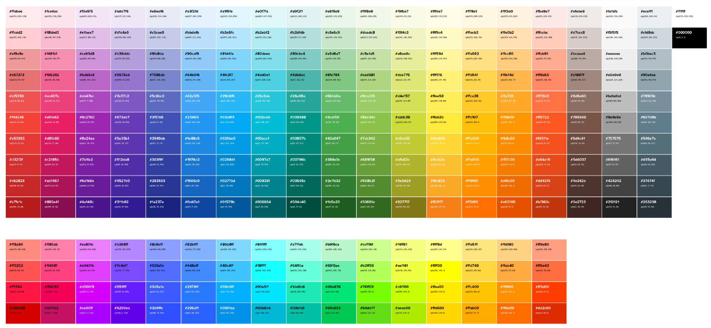{height="250"}

::: notes
:::

## Color

### Or use premade color palette packages!

- [RColorBrewer](https://cran.r-project.org/web/packages/RColorBrewer/index.html)
- geological timescale palettes in [deeptime](https://cran.r-project.org/web/packages/wesanderson/index.html)
- [viridis](https://cran.r-project.org/web/packages/viridis/index.html)
  - designed for accessibility
- [wesanderson](https://cran.r-project.org/web/packages/wesanderson/index.html)

{height="100"}

::: notes
:::

## Color

### Color accessibility is important!

The more color contrast the better!

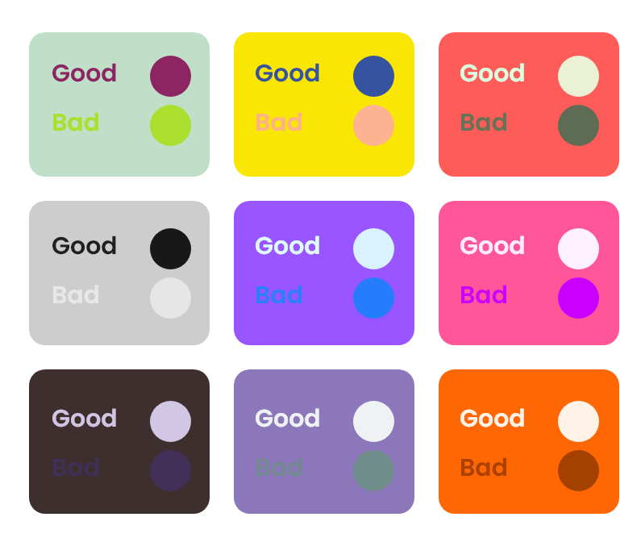{height="500"}

::: notes
:::

## Color

### Don't forget about color blindness!

Check your graphs with a color blindness simulator (e.g., [Coblis color blindness simulator](https://www.color-blindness.com/coblis-color-blindness-simulator/ 
) or [ColorOracle](https://www.colororacle.org/)).\
\

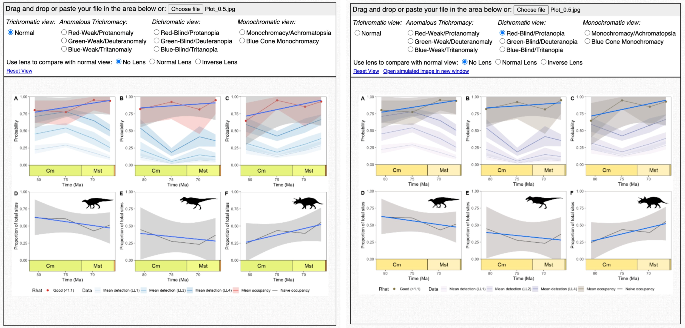{height="375"}

::: notes
:::

## Color

### Your graphs should even be legible in grayscale
\

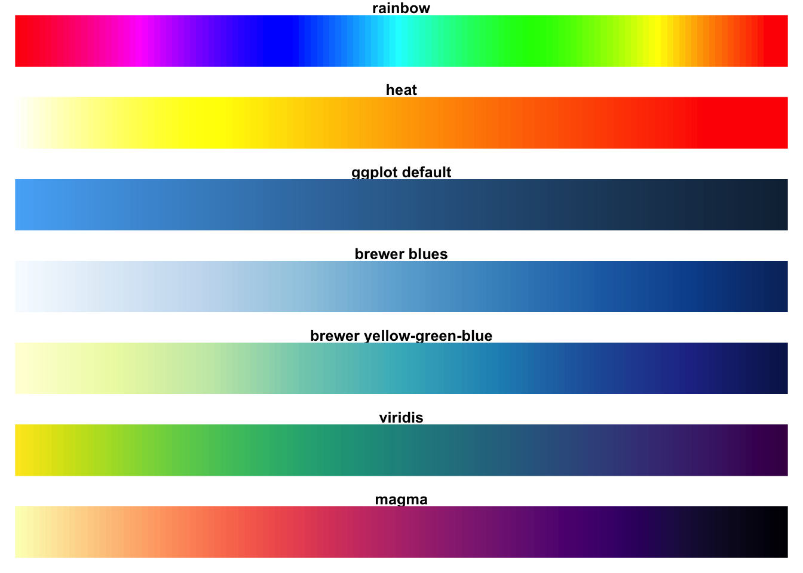{height="350"}
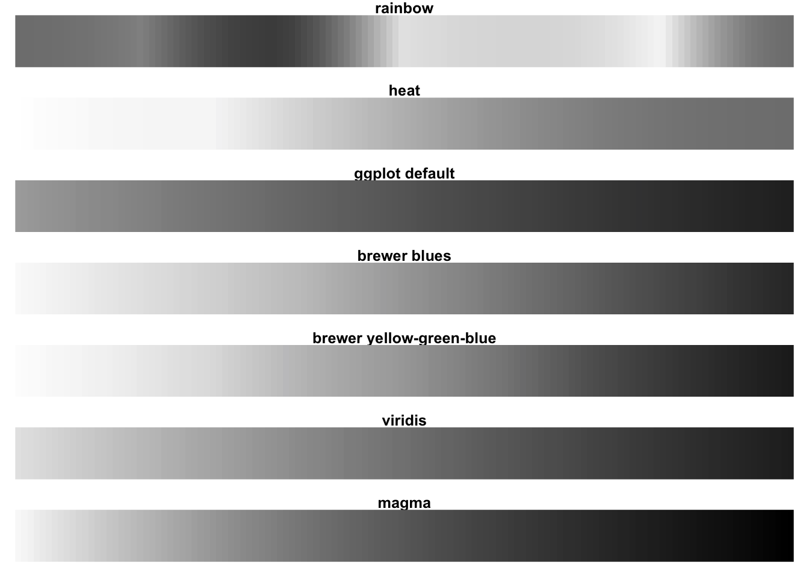{height="350"}

::: notes
Right is desaturated
:::

## Color

### Effective use of color

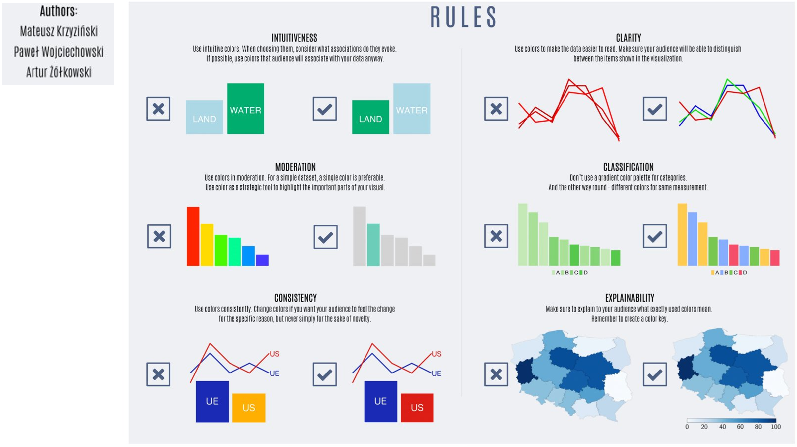{height="500"}

## Color

### Effective use of color

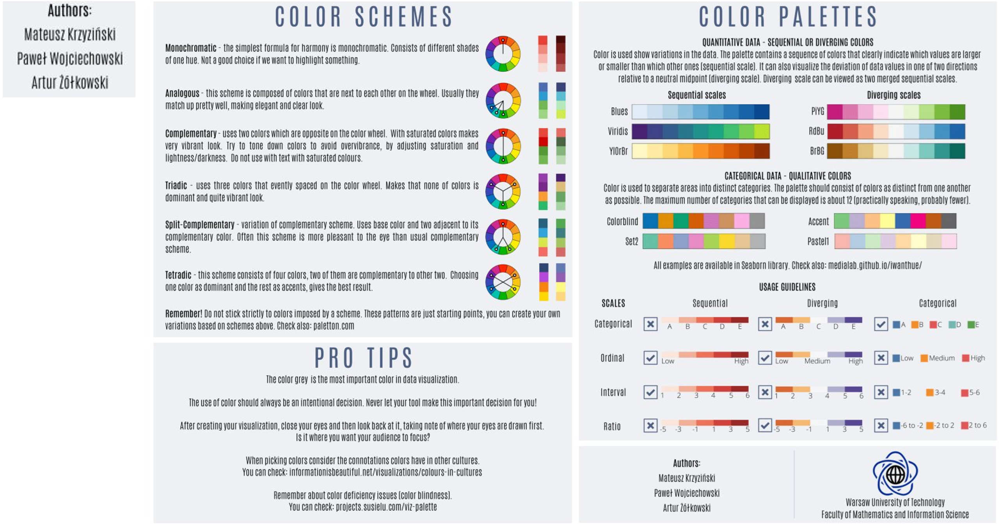{height="500"}

## Font

### There are lots of fonts/types, too!

[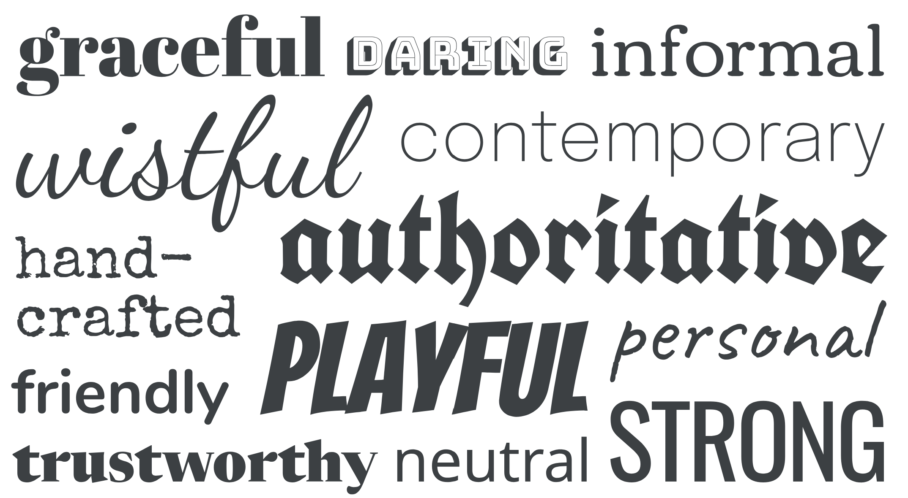{height="500"}](https://fonts.google.com/knowledge/choosing_type/emotive_considerations_for_choosing_typefaces)

::: notes

:::

## Font

### We want easily readable fonts:

- Tahoma
- Calibri
- Helvetica
- Arial\
\

- Find more at [Google Fonts](https://fonts.google.com/)
  - Can import these into R using the [<code>sysfonts</code> package](https://babichmorrowc.github.io/post/2019-10-11-google-fonts/)

::: notes

:::

## Font

### Tips

- One font is usually enough (max two)
- Make sure font size is big enough (who is the audience?)
- Use __bold__ for emphasis, but avoid _italics_ and <u>underlines</u>
- Left-aligned text is most readable
- Use size as a tool to hierarchize content
- Use 1.5 line spacing for better readability

::: notes
Italics and underlines decrease accessibility (e.g., dyslexia)
:::

## Visual hierarchy

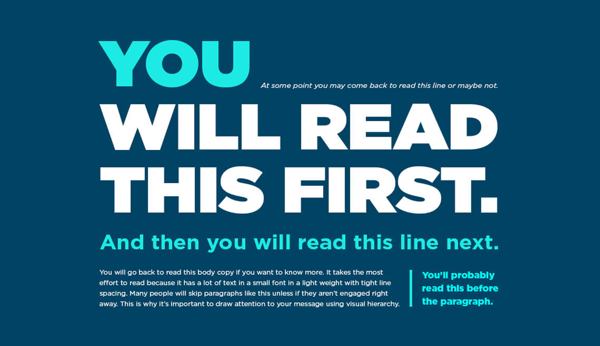{width=100%}

::: notes
- size
- color
- contrast
- texture
- alignment
- proximity
:::

## What makes a figure effective?

::: columns
::: column
::: {style="font-size: 0.65em;"}
- tells a story with the data
- patterns are represented in a clear, honest, and intuitive way
- uses an appropriate graph type
- graph design is accessible and emphasizes the main message (minimal clutter)
- aesthetics are consistent
- visual hierarchy that draws the eye to the most important parts of the graph
- includes labels for context
:::
:::

::: column
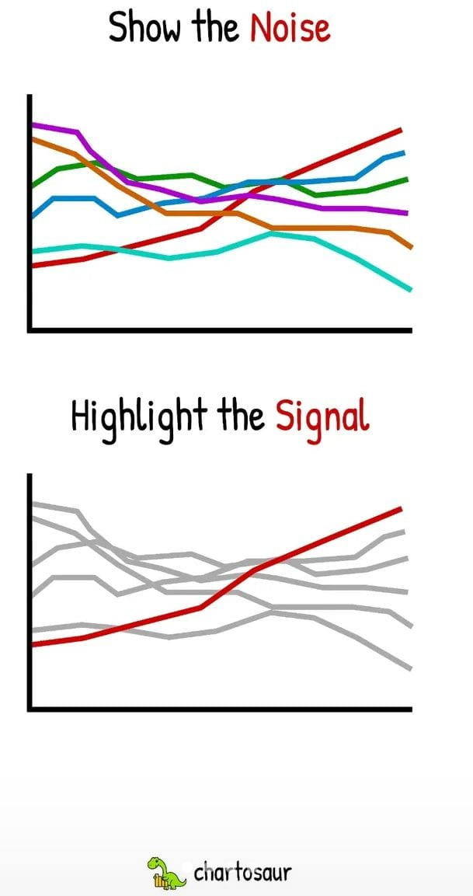{width=60%}
::: 
:::

# Visualization in R

## Visualization in R

### R has lots of built-in visualization functionality:

- <code>plot()</code>
- <code>barplot()</code>
- <code>hist()</code>
- <code>boxplot()</code>
- <code>axis()</code>
- <code>legend()</code>
- <code>lines()</code>, <code>segments()</code>, <code>rect()</code>, <code>text()</code>, etc.

::: notes
We call all of this 'base' graphics, because it is all included in the packages that come with R, including the 'graphics' and 'stats' packages.

Note that `base` graphics is done on a static canvas and objects are drawn on the device through R plotting commands. The canvas has a set of global parameters such as margins and layouts which can be manipulated by the user using par() commands. The R graphics engine does not maintain a user visible graphics list. Ojects cannot be easily edited without redrawing a whole plot.
:::

## Visualization in R

[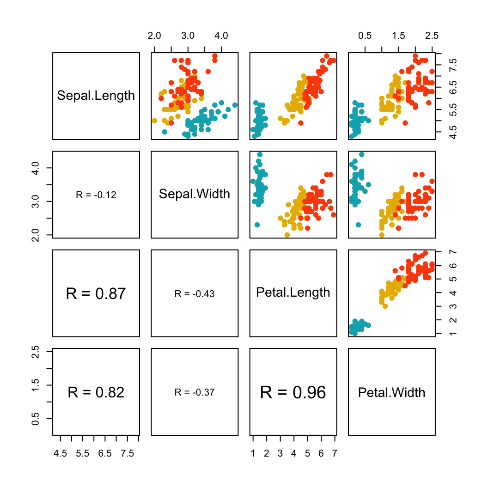{height="550"}](http://www.sthda.com/english/wiki/r-base-graphs)

::: notes
You can make some pretty complex plots with 'base' R graphics!
:::

## Visualization in R

### Many packages build on these 'base' graphics:

- <code>{plotrix}</code>
- <code>{rgl}</code>: for 3D interactive graphics
- <code>{gplots}</code>
- <code>{scatterplot3d}</code>: 3D scatterplots
- <code>{palaeoverse}!</code>

::: notes
Some functions in the palaeoverse package produce base R plots. We've done this to reduce the number of dependencies that users need to install when they install the palaeoverse package. Note: It also has the axis_geo() function to add a timescale to an existing base R plot.
:::

## Visualization in R

### Then 'grid' graphics came along:

- More complex layouts
- Scaling is maintained on resizing
- Nested graphs and more interactivity

[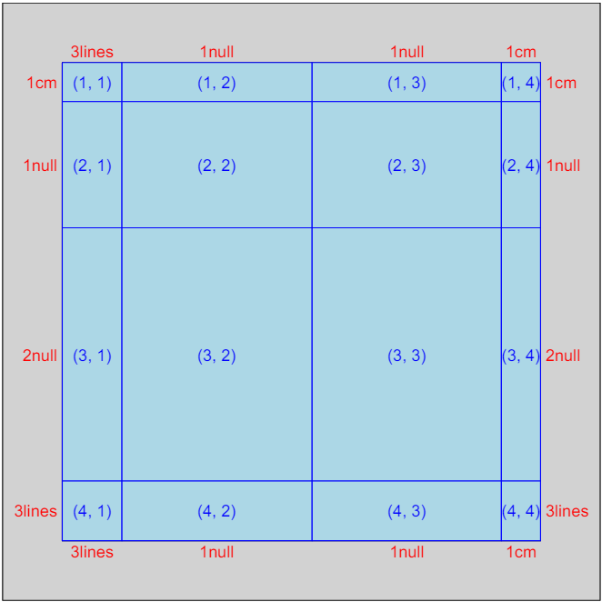{height="300"}](https://stat.ethz.ch/R-manual/R-devel/library/grid/doc/grid.pdf)

::: notes
However, one can quickly run into trouble with R's base graphic system if one wants to design complex layouts where scaling is maintained properly on resizing, nested graphs are desired or more interactivity is needed. grid was designed by Paul Murrell to overcome some of these limitations.

Note that each component has a size, if you were scale this larger or smaller, all of those relative sizes would be preserved (unlike in base R graphics).
:::

## Visualization in R

### Many packages build on these 'grid' graphics:

- <code>{lattice}</code>: trellis graphics
- <code>{vcd}</code>: for categorical data
- <code>{ggplot2}</code>: "grammar of graphics"
- <code>{hexbin}</code>: hexagonal bins
- <code>{patchwork}</code>: combine (ggplot2) plots
- <code>{deeptime}!</code>

::: notes
In our practical, we'll be exploring ggplot2. The deeptime package that I've developed helps to make plots with ggplots2 (mostly). For example, it has the coord_geo() function which adds a timescale to an existing ggplot2 plot.
:::

## Visualization in R

### Packages for spatial visualization:

- <code>{sf}</code>: basic objects and methods for vector data
- <code>{terra}</code>: basic objects and methods for raster data
- <code>{ggplot2}</code>: works for plotting spatial data, too
- <code>{raster}</code>: plotting raster data

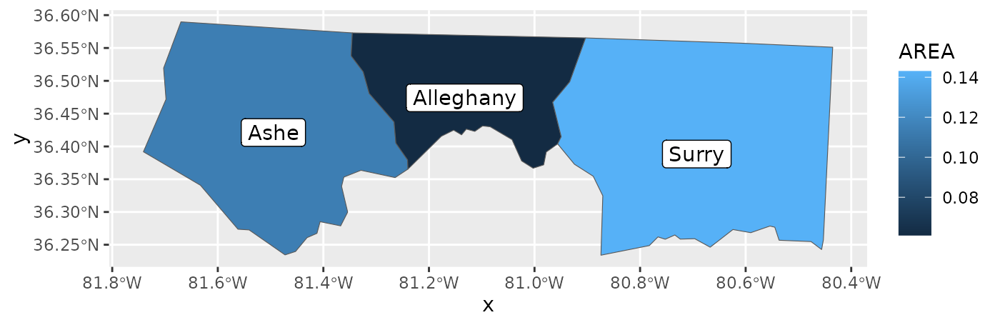{height="200"}

::: notes
In our practical, we'll also be exploring using and visualizing spatial objects.
:::

## Visualization in R

### File formats:

You can export plots from R in many file formats (we'll mostly use <code>ggsave()</code>):\
\

::: {style="font-size: 0.65em;"}
| File format | Image type | Notes |
| :- | :- | :----- |
| .jpg | Raster | Can't have transparent parts |
| .png | Raster | Can also have transparent parts |
| .svg | Vector | Can edit in Inkscape/Illustrator |
| .pdf | Vector | Not actually an image file type, but can be used |
:::

::: notes
I personally like .pdfs because they are easily shareable and are a pretty common file format for everyone. Pdfs can even be imported into inkscape and illustrator for editing (I'd encourage you to try to do all of your customization within R, but I know some things still aren't possible/easy in R). svgs are also great, but I find they are less supported by email clients and slack, etc. pngs are great, but don't scale (get pixellated), so never use them for publications, etc
:::

## Data visualization books

::: {style="font-size: 0.55em;"}
::: {.columns .h4}
::: {.column width="20%"}
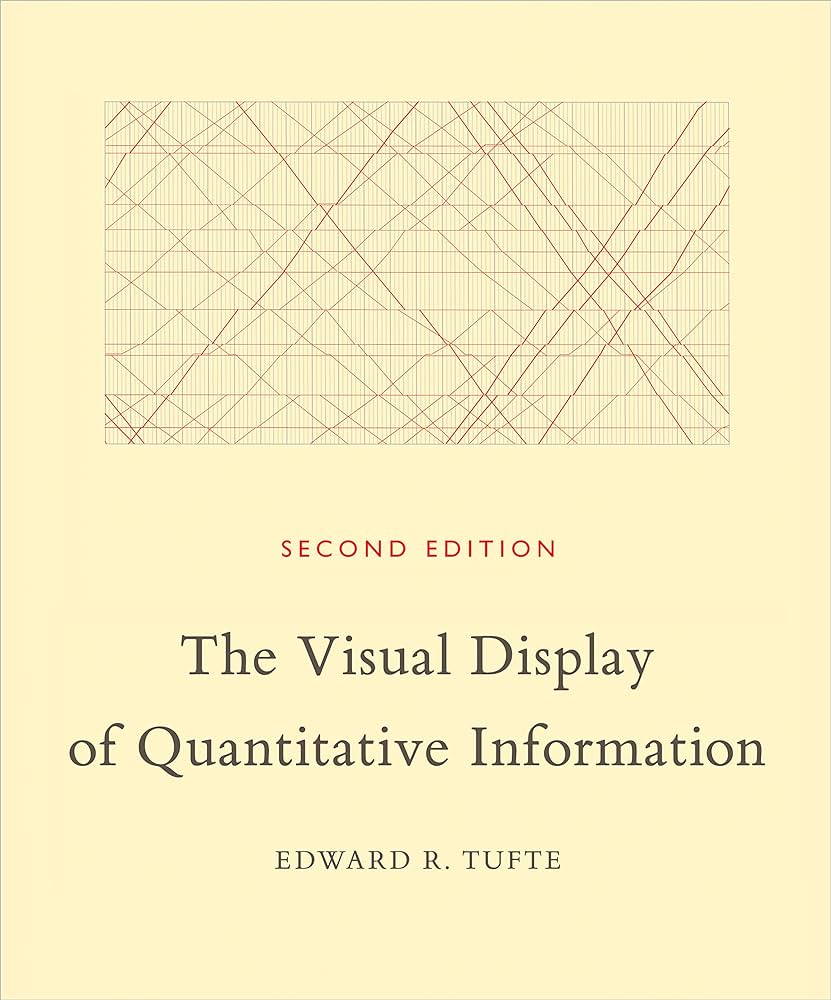{width="100%"}
:::

::: {.column width="20%"}
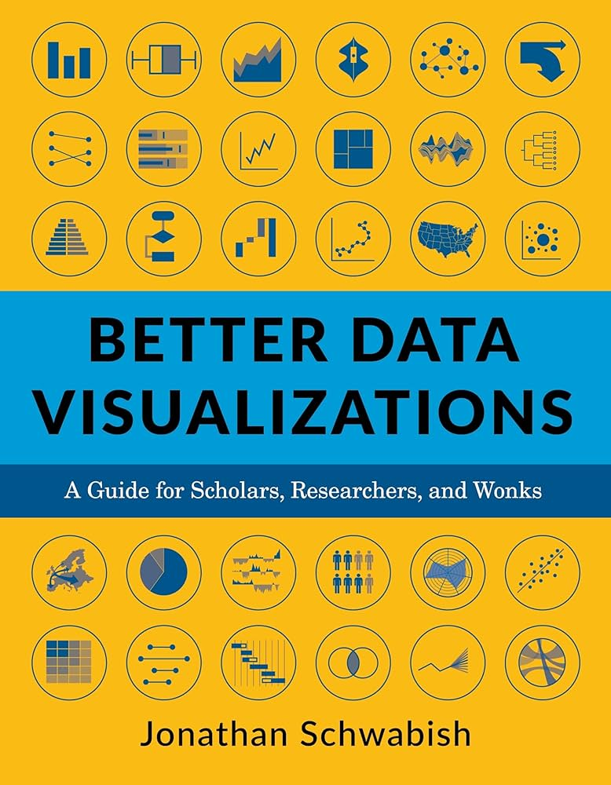{width="100%"}
:::

::: {.column width="20%"}
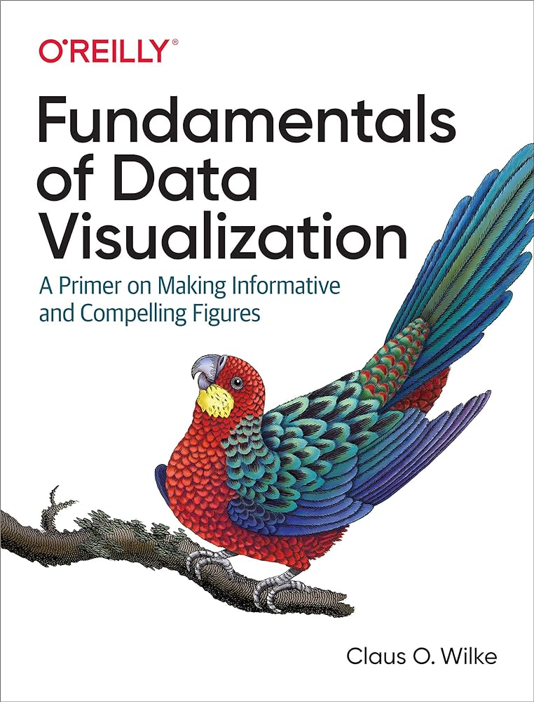{width="100%"}
:::

::: {.column width="20%"}
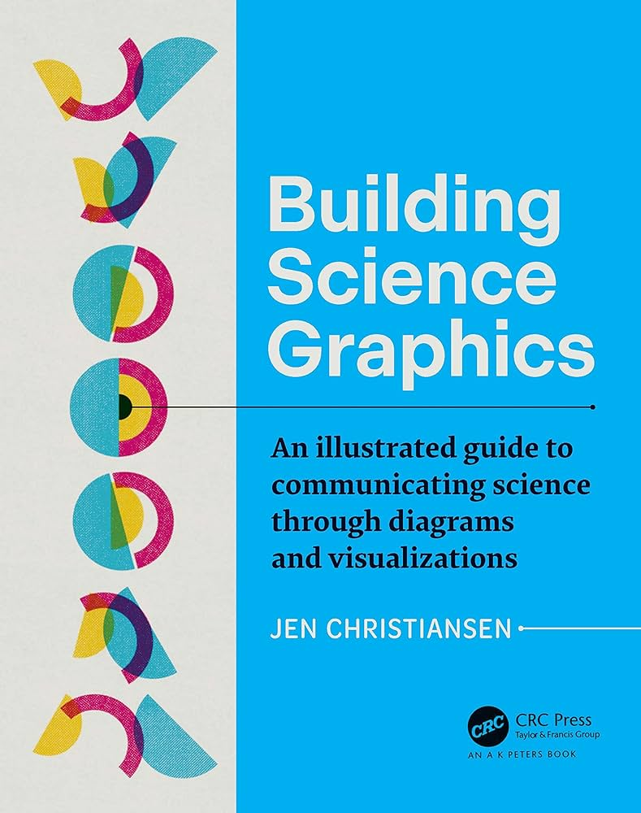{width="100%"}
:::

::: {.column width="20%"}
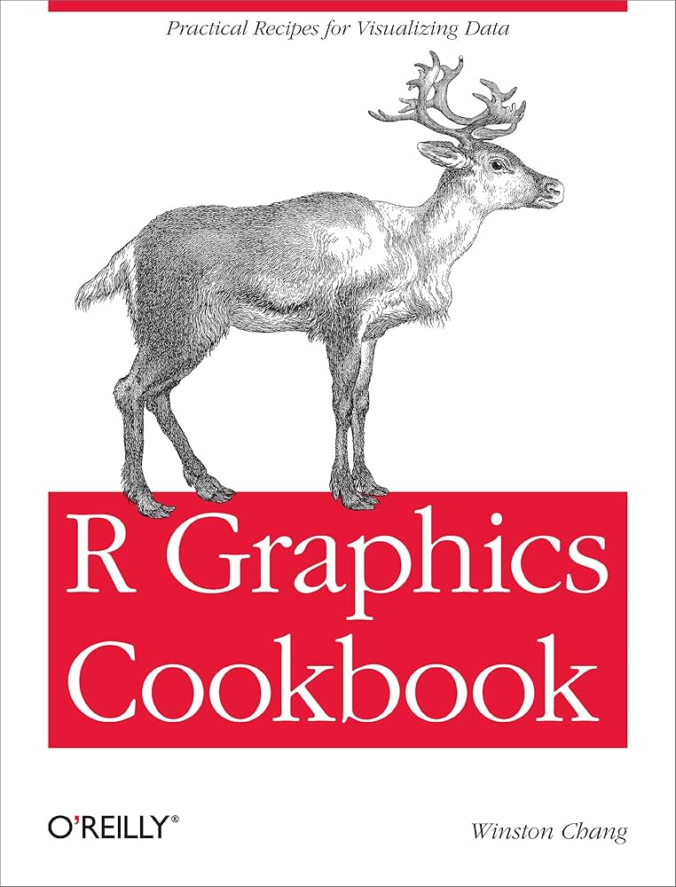{width="100%"}
:::
:::
- [Royal Statistical Society best practices](https://royal-statistical-society.github.io/datavisguide/)
- [R for Data Science](https://r4ds.had.co.nz/data-visualisation.html)
:::

# Data visualization practical

