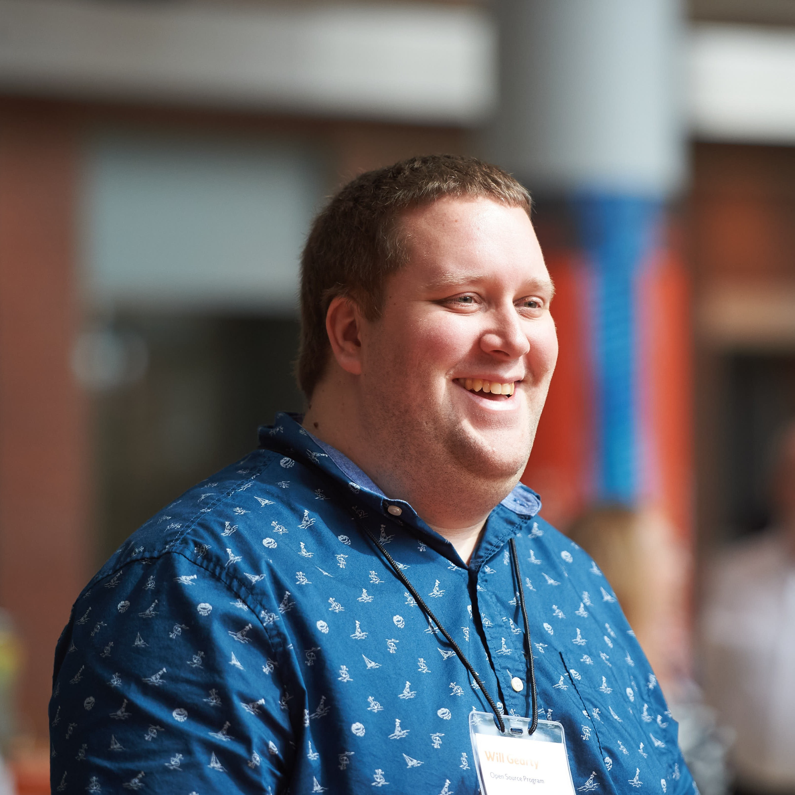
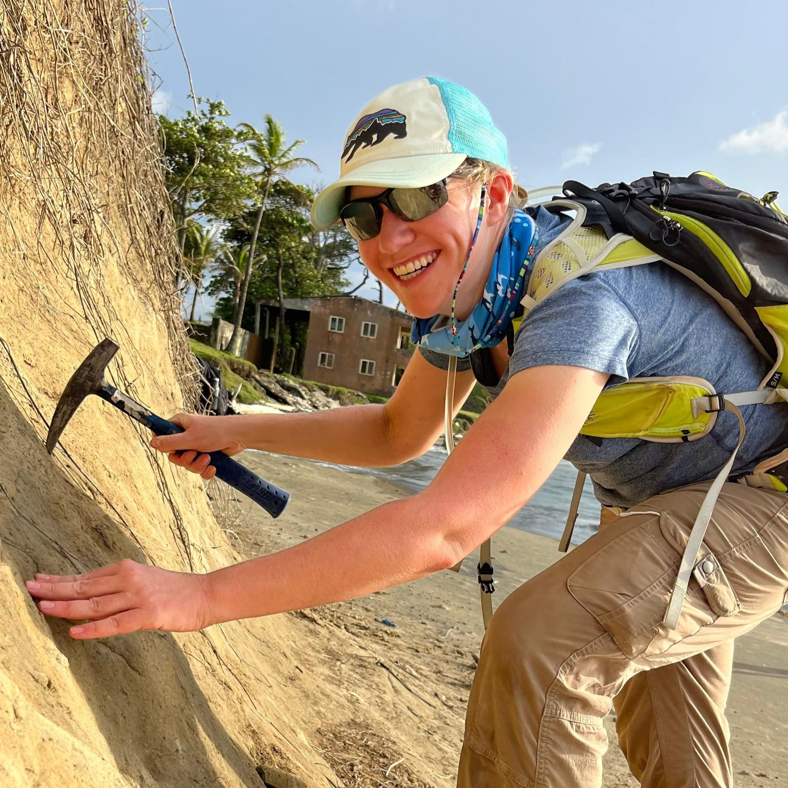
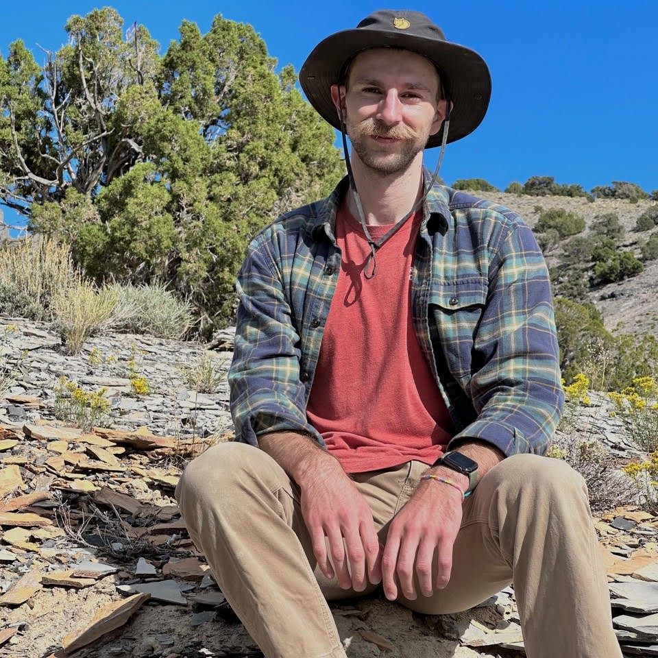
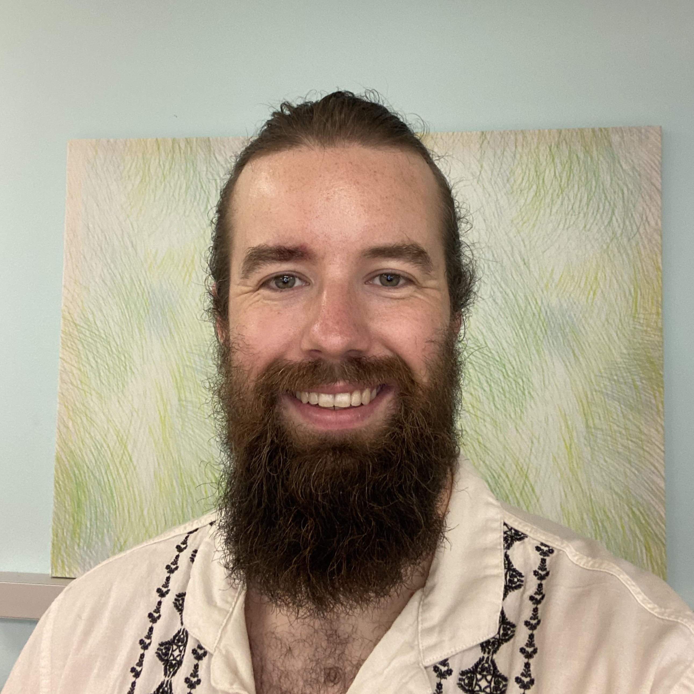
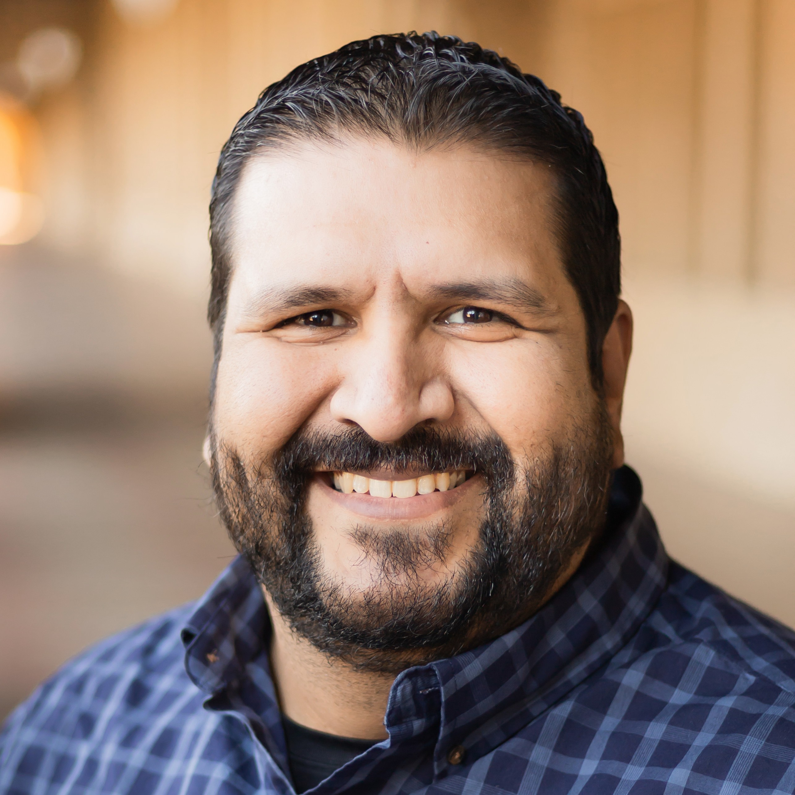
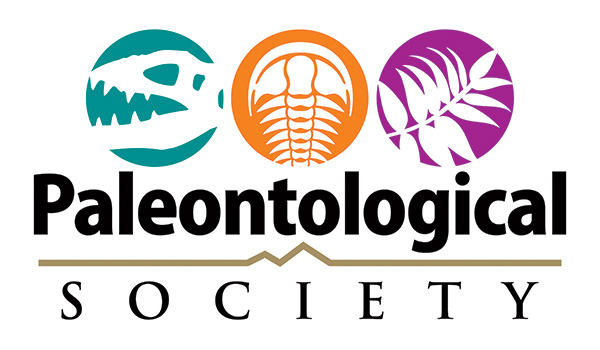

**Saturday, October 18, 2025**<br>
8:00 AM - 5:30 PM

**Room 211**<br>
Henry B. González Convention Center<br>
San Antonio, TX, USA

# Welcome

Since the development of large paleontological datasets from the 1970s onwards, paleontologists have increasingly adopted computational approaches to address questions about the history of life on Earth. This initiated a “Golden Age” of paleontology, where extensive datasets of various formats are used to test macroevolutionary and macroecological hypotheses. In parallel, the broader scientific community has been pushing for science to become more transparent, equitable, collaborative, and reproducible under the umbrella of “Open Science”. This culminated in 2023 being designated as the “Year of Open Science” by the White House Office of Science and Technology Policy. This short course will bridge these two movements to introduce the tenets of Open Science and how they can be incorporated into existing and future paleontological research workflows. First, we will provide an introduction to collaboration, version control, and data storage via services including Git, GitHub, Zenodo, and FigShare. We will then build upon this foundation by exploring the R programming language. R is one of the most popular languages in the world of data science and has been widely adopted by the paleontological community to clean, analyze, and plot data. General familiarity with R allows users to expand the potential of their research and automate routine tasks. We will introduce a suite of R packages that have been designed to standardize and streamline various parts of paleontological workflows (e.g., data cleaning). As part of this, we will briefly introduce existing paleontological databases (e.g., Paleobiology Database) and how they can be accessed from within the R framework. Finally, we will discuss the use of visualizations and how they can be efficiently and effectively developed to increase the transparency and equitability of paleontological research. This short course will provide a great opportunity for attendees to work with different researchers and gain experience working collaboratively in R to generate reproducible research. Further, we hope that this short course will bring the community together to share resources, reach agreed standards, and improve reproducibility in paleontological research. We anticipate this short course will be of value to paleontologists of all career stages.

## Arrival

The workshop takes place 8:00 AM - 5:30 PM on Saturday, October 18, 2025. Check-in starts at 7:30 AM.

## Schedule

| Time      | Event                                                     |
|-----------|-----------------------------------------------------------|
| **08:00 AM** | [**Welcome and introduction**](01_introduction/index.qmd)   |
| **08:30 AM** | [**Setting up a reproducible workflow (GitHub, GitHub Desktop, RStudio)**](02_workflow/index.qmd)      |
| **10:00 AM** | ***Coffee break*** ☕                                     |
| **10:15 AM** | [**Data acquisition**](03_acquisition/index.qmd)          |
| **10:45 AM** | [**Data Processing I: Data exploration and cleaning**](04_exploration/index.qmd)      |
| **12:00 PM** | ***Lunch break*** 🥪                                     |
| **1:30 PM**  | [**Data Processing II: Data visualization and synthesis**](05_harmonization/index.qmd)  |
| **3:15 PM**  | ***Coffee break*** ☕                                     |
| **3:30 PM**  | [**Open science practices presentation/breakout**](06_archiving/index.qmd)  |
| **4:45 PM**  | [**Closing remarks**](07_wrap-up/index.qmd)                                 |

## Instructors

This edition of the Workshop event is organised and led by the following members and friends of the Palaeoverse team.

::: {.grid}

::: {.g-col-4}

{width="100%"}

:::

::: {.g-col-4}

{width="100%"}

:::

::: {.g-col-4}

{width="100%"}

:::

::: {.g-col-4}

{width="100%"}

:::

::: {.g-col-4}

{width="100%"}

:::

:::

## Installation

Please ensure that you have the latest version of R for the workshop, which can be downloaded [here](https://cran.r-project.org/bin/windows/base/). We also recommend installing the latest version of RStudio, which can be downloaded [here](https://posit.co/download/rstudio-desktop/). To minimize any installation issues during the workshop, please also install the following R packages:

```{R install}
#| eval: false
install.packages("rmarkdown", "dplyr", "readr", "deeptime", "fossilbrush", "ggplot2", "palaeoverse", "rgplates", "rnaturalearth", "rnaturalearthdata")
```

## Acknowledgements

This event is run by the [Palaeoverse](https://palaeoverse.org) and supported by the [Paleontological Society](https://www.paleosoc.org/).

::: {layout-ncol=2 layout-valign="center"}



:::

more testing

