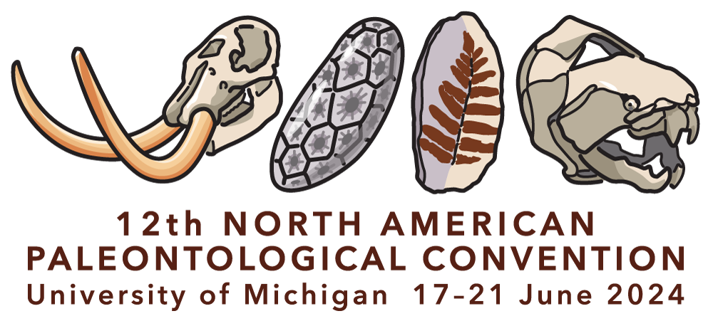

**08:00--12:00 - 19^th^ June 2024**  
[Room 1010, Biological Sciences Building, 1105 North University Avenue, Ann Arbor, MI 48109-1085](https://maps.app.goo.gl/fU1zDr1Cu6T5hWWc8)

# Welcome

Welcome to the second edition of **R for Palaeobiologists: Workshop**. R is one of the most popular languages in the world of Data Science and has been widely adopted by the palaeobiological community to clean, analyse and plot data. General familiarity with R allows users to expand the potential of their research and automate routine tasks. Importantly, it allows researchers to improve the reproducibility of their research and document their analyses. This workshop will introduce you to [palaeoverse](www.palaeoverse.palaeoverse.org), an R package which supports data preparation and exploration for palaeobiological analysis, improving code reproducibility and accessibility. The event will also introduce databases (e.g. Paleobiology Database) and building workflows in R (e.g. data cleaning) using palaeoverse. Additional packages developed by [Palaeoverse](www.palaeoverse.org), such as [rphylopic](www.rphylopic.palaeoverse.org), will also be introduced along with the versatility R has to offer. 

## Arrival

The event starts at 08:00 on the 19^th^ June 2024 and will take place in [Room 1010, Biological Sciences Building, 1105 North University Avenue, Ann Arbor, MI 48109-1085](https://maps.app.goo.gl/fU1zDr1Cu6T5hWWc8). You should enter the building from XXX. We will meet you there from 07:55.

The full schedule for the workshop is available [here](/schedule.qmd).

## Installation

Please ensure that you have the latest version of R for the workshop, which can be downloaded [here](https://cran.r-project.org/bin/windows/base/). We also recommend installing the latest version of RStudio, which can be download [here](https://posit.co/download/rstudio-desktop/). To minimise any installation issues during the workshop, please also install the following R packages:

```{R install}
#| eval: false
install.packages("deeptime", "dplyr", "extrafont", "ggplot2", "ggpubr", 
                 "maps", "microbenchmark", "palaeoverse", "profvis","raster", 
                 "RColorBrewer", "rgplates", "roxygen2", "rpaleoclim",
                 "sf", "svglite", "terra", "testthat", "usethis")
```


## Acknowledgements

This event is run by the [Palaeoverse](https://palaeoverse.org) development team and supported by the organisers of the 12^th^ North American Paleontological Convention. We thank the organisers for their support in facilitating this workshop. 

{width="20%"} {width="40%"}

