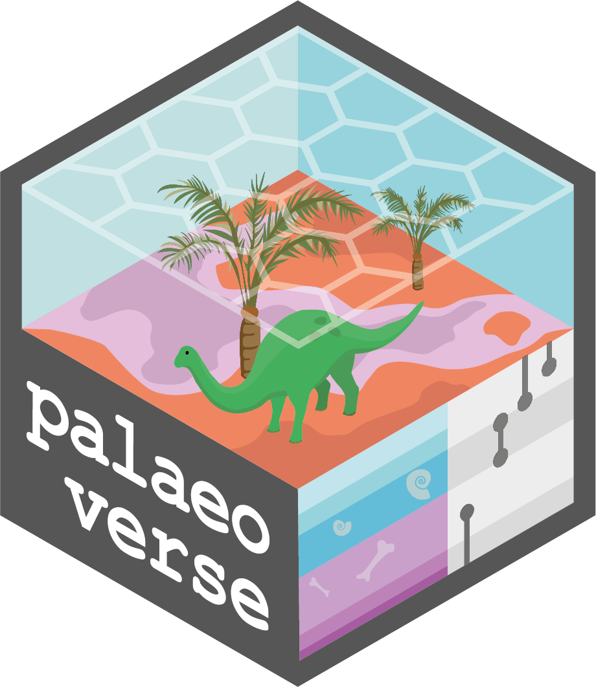

## Summary

This unit of the workshop introduces a variety of resources that are of relevance to palaeobiological analyses and palaeontologists more broadly. The slides for the unit are available here and provide an overview to these commonly used resources, along with links to relevant websites and other content. This acts as both a summary of the resources mentioned in the other Units, as well as including additional resources which may be of interest.

This session is led by Christopher Dean and Erin Dillon. If you encounter any issues while working with these resources, please contact either [Chris](mailto:christopherdaviddean@gmail.com) or [Erin](mailto:emdillon23@gmail.com). Additionally, our aim is to expand upon this content to make it a more widely available resource; if you have any resources that you use that you think might be helpful to others, please add them to the growing Palaeoverse resources database [here](https://docs.google.com/spreadsheets/d/1ZwvmmBUEPZzGEcdE-ZWYPDGkafYcfSQkYwue9cQ_x9c/edit?usp=sharing).

## Content (under construction)

### Data Acquisition

These resources cover the acquisition of data for palaeontological analyses, including occurrence datasets as well as covariate and other associated data.

#### Occurrence Databases

-   [Paleobiology Database](http://paleobiodb.org){target="_blank"}

-   [Geobiodiversity database](http://giobiodiversity.com){target="_blank"}

-   [Neotoma](http://neotomadb.org){target="_blank"}

-   [GBIF](http://gbif.org){target="_blank"}

-   [iDigBio](http://idigbio.org){target="_blank"}

-   [Neptune](http://nsb.mfn-berlin.de){target="_blank"}

-   [BioDeepTime](http://dio.org/10.1111/geb.13735){target="_blank"}

-   [Phylacine](http://megapast2future.github.io/PPHYLACINE_1.2/){target="_blank"}

-   [PARED](http://paleo-reefs.pal.uni-Erlangen.de){target="_blank"}

#### 3D Datasets

-   [DigiMorph](http://digimorph.org){target="_blank"}

-   [Morphobank](http://morphobank.org){target="_blank"}

-   [Phenome10k](http://www.phenome10k.org){target="_blank"}

-   [Morphosource](http://morphosource.org){target="_blank"}

-   [Digital Atlas of Ancient Life](https://www.digitalatlasofancientlife.org/){target="_blank"}

#### Trait Datasets

-   [Open Traits Network](https://opentraits.org){target="_blank"}

-   [Coral Trait Database](https://www.coraltraits.org/){target="_blank"}

#### Covariate Datasets

-   [Macrostrat](http://macrostrat.org){target="_blank"}

-   [USGS Geological Maps of North America](https://mrdata.usgs.gov/geology/state/){target="_blank"}

-   [Mindat](https://www.mindat.org/){target="_blank"}

-   [WorldClim](http://worldclim.org){target="_blank"}

-   [ESA WorldCover](http://esa-worldcover.org/en){target="_blank"}

-   [Digital Elevation Maps](https://www.usgs.gov/centers/eros/science/usgs-eros-archive-digital-elevation-global-30-arc-second-elevation-gtopo30?qt-science_center_objects=0#qt-science_center_objects){target="_blank"}

-   [Global Maximum Green Vegetation Fraction](https://doi.org/10.1175/JAMC-D-13-0356.1){target="_blank"}

-   [Deep Time Maps](https://deeptimemaps.com/about-us/){target="_blank"}

-   [Paleomap Project](http://www.scotese.com/){target="_blank"}

#### Additional Lists of Databases

-   [Examples of databases and online data portals used in paleo research (Table 1)](https://zenodo.org/records/7340036){target="_blank"}

-   [PAGES](https://pastglobalchanges.org/science/data/databases){target="_blank"}

### Data Preparation

These resources cover the preparation of data for palaeontological analyses, including data cleaning, organisation and transformation.

#### General Resources

-   [Data cleaning](https://www.knowledgehut.com/blog/data-science/data-cleaning#what-is-data-cleaning-in-data-science?-%C2%){target="_blank"}

-   [Tidy data](https://www.dataone.org/webinars/tidy-ing-your-data-simple-steps-reproducible-research/){target="_blank"}

-   [R cheat sheets](https://posit.co/resources/cheatsheets/){target="_blank"}

#### Examples of Packages for Data Cleaning and Preparation

-   [janitor]

-   [Data.validator]

-   [CoordinateCleaner]

-   [Fossilbrush]

-   [Palaeoverse]

-   [Also check out this list of generally useful R packages here (Table 2)](https://zenodo.org/records/7340036){target="_blank"}

### Data Visualisation

These resources cover the various ways in which data can be visualised, from theoretical, practical and ethical angles.

#### General Resources

-   [Best Practices for Data Visualisation (Royal Society Guide)](https://royal-statistical-society.github.io/datavisguide/){target="_blank"}

-   [R Graph Gallery](https://r-graph-gallery.com/){target="_blank"}

-   [Plotly](https://plotly.com/r/){target="_blank"}

-   [COBLIS (Colour Blindness Simulator)](https://www.color-blindness.com/coblis-color-blindness-simulator/){target="_blank"}

-   [Colorhunt](https://colorhunt.co/){target="_blank"}

-   [Inkscape (vector graphics)](https://inkscape.org/){target="_blank"}

-   [GIMP (raster graphics)](https://www.gimp.org/){target="_blank"}

#### Examples of Packages for Data Visualisation

-   [ggplot2]

-   [Lattice]

-   [deeptime]

-   [geoscale]

### General Palaeontology Resources

-   [Palaeoverse](http://palaeoverse.org){target="_blank"}

-   [Palaeoverse Google Group](https://groups.google.com/g/palaeoverse){target="_blank"}

-   [Paleonet](https://paleonet.org/){target="_blank"}

#### Associations and Networks

-   [Paleontological Society](https://www.paleosoc.org/){target="_blank"}

-   [Palaeontological Association](https://www.palass.org/){target="_blank"}

-   [PAGES (Past Global Changes) Network](https://pastglobalchanges.org/){target="_blank"}

-   [Conservation Paleobiology Network](https://conservationpaleorcn.org/){target="_blank"}

-   [Earth Science Women’s Network](https://eswnonline.org/){target="_blank"}

-   [PaleoSynthesis Project](https://www.paleosynthesis.nat.fau.de/){target="_blank"}

#### Workshops and Courses

### General Programming Resources

### \--

### Problem Solving Tips

\--

{fig-align="right" width="25%"}
